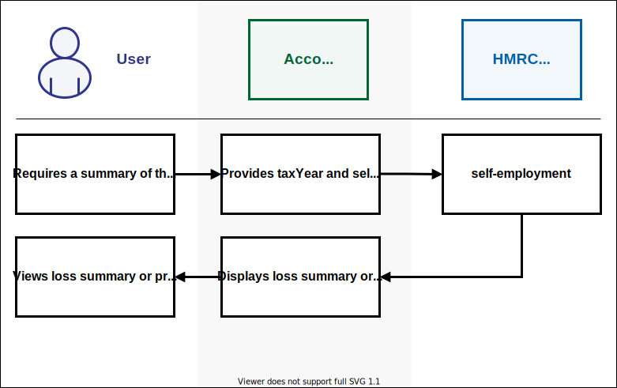

<!--- Section owner: MTD Programme --->

# Business and Property Income

A customer’s MTD mandated income consists of the following:

- self-employed sole trader income
- property income

This is the ‘qualifying’ income HMRC uses to establish if the customer meets the criteria for MTD.  MTD Customers can have one, or multiple, businesses with these types of income. For more information on qualifying income, refer to [Check what is included in your qualifying income](https://www.gov.uk/guidance/check-if-youre-eligible-for-making-tax-digital-for-income-tax#check-what-is-included-in-your-qualifying-income).

### Self-employed sole trader income

If the customer is working for themselves, they are a sole trader. For more information on identifying self-employed sole traders, refer to [Working for yourself](https://www.gov.uk/working-for-yourself?step-by-step-nav=01ff8dbd-886a-4dbb-872c-d2092b31b2cf). Currently, self-employment income refers to sole trader self-employment income and not income earned through partnerships. This exclusion also applies to directors of limited companies.

### Property income

A customer’s property income includes the following:

- rental income and other receipts from UK land or property
- rental income and other receipts from foreign land or property
- income from letting furnished rooms in customer’s own home
- income from furnished holiday lettings (FHL) and non-furnished holiday lettings (non-FHL) in the UK
- premiums from leasing UK land
- inducements to take an interest in letting a property (a reverse premium)

For more information on property income, refer to [Work out your rental income when you let property (GOV.UK)](https://www.gov.uk/guidance/income-tax-when-you-rent-out-a-property-working-out-your-rental-income).

## Retrieving obligations

An MTD mandated or voluntary customer will have a set of obligations for each tax year. These are:

- four quarterly updates
- final declaration 

At any time of the year, customers can check their obligations. To provide this information, the software needs details about their business income sources. It gets this information by using the [List All Businesses](/api-documentation/docs/api/service/business-details-api/1.0/oas/page#/paths/~1individuals~1business~1details~1%7Bnino%7D~1list/get) endpoint, which provides the business ID. This ID is required to call multiple self-employment and property endpoints. To save time, the software should store this ID instead of making extra calls.

Quarterly obligations are created for sole trader and property income sources. In software, the retrieval of customer’s obligations is done by calling any of the following endpoints depending on the customer’s type of income source:

- [Retrieve Income Tax (Self Assessment) Income and Expenditure Obligations](/api-documentation/docs/api/service/obligations-api/2.0/oas/page#/paths/~1obligations~1details~1%7Bnino%7D~1income-and-expenditure/get)
- [Retrieve Income Tax (Self Assessment) Final Declaration Obligations](/api-documentation/docs/api/service/obligations-api/2.0/oas/page#/paths/~1obligations~1details~1%7Bnino%7D~1crystallisation/get)

These endpoints provide obligation dates for all self-employment and property businesses, and inform whether or not obligations have been met. The deadline for meeting a quarterly obligation is one month after the obligation period end date. The software should communicate these deadlines clearly to the customer and prompt them to submit the information when the update is due. 

A customer should always be able to view their latest obligations. To do this, the software should be aware that the customer’s obligation will be created or updated for the following reasons:

- start of financial year
- when a customer submits updates
- when a customer adds a new sole trader business in HMRC online services
- when a customer ceases an existing business in HMRC online services

## Submit quarterly updates for self-employment and property businesses

MTD mandated and voluntary customers must maintain and submit digital records of their self-employment and property business income and expenses every quarter. If they wish, they can also submit summary-level information more frequently, for example, monthly.

Customers must submit at least one update for each quarter. The following table shows an example.

| Update | Quarter(s) | Result |
| ------ | ---------- | ------ |
| 1 | 1 | 6 April to 5 July is accepted |
| 2 | 2 | 6 July to 5 October is accepted |
| 3 | 3, 4 | 6 October to 5 April is accepted with a possible penalty |

### Submit quarterly update

The software should convert transactional information into summary totals. It should categorise these totals as income or expenses. It should send this summary information to HMRC for each self-employment and property income source. HMRC can then use this information to calculate business profits based on the most recent data.

When the tax calculation is triggered, it means that the quarterly obligation has been fulfilled, if the data covers the entire period. If the calculation fails, the obligation will not be marked as fulfilled. Customers can also check the status of their [obligations](#retrieving-obligations) through HMRC online services.

<a href="figures/submit-periodics.svg" target="blank">Open the submit periodics diagram in a new tab</a>.

#### User journey

1. The software prompts the customer when they need to submit an update. This prompt will not be sent from any API.

2. The customer receives the prompt in the software and begins their submission process.

3. Software prepares the summary information and displays it to the customer.

4. The customer checks the information and submits it.

5. The software initiates the data submission process by calling one of the following endpoints, depending on the income source type being submitted:
   - [Create a Self-Employment Period Summary](/api-documentation/docs/api/service/self-employment-business-api/3.0/oas/page#tag/Self-Employment-Period-Summaries/paths/~1individuals~1business~1self-employment~1{nino}~1{businessId}~1period/post)
   - [Create a UK Property Income and Expenses Period Summary](/api-documentation/docs/api/service/property-business-api/3.0/oas/page#tag/UK-Property-Income-and-Expenses-Period-Summary/paths/~1individuals~1business~1property~1uk~1{nino}~1{businessId}~1period~1{taxYear}/post)
   - [Create a Foreign Property Income and Expenses Period Summary](/api-documentation/docs/api/service/property-business-api/3.0/oas/page#tag/Foreign-Property-Income-and-Expenses-Period-Summary/paths/~1individuals~1business~1property~1foreign~1{nino}~1{businessId}~1period~1{taxYear}/post)
   - [Create a Historic FHL UK Property Income and Expenses Period Summary](/api-documentation/docs/api/service/property-business-api/3.0/oas/page#tag/Historic-FHL-UK-Property-Income-and-Expenses-Period-Summary/paths/~1individuals~1business~1property~1uk~1period~1furnished-holiday-lettings~1{nino}/post)
   - [Create a Historic Non-FHL UK Property Income and Expenses Period Summary](/api-documentation/docs/api/service/property-business-api/3.0/oas/page#tag/Historic-non-FHL-UK-Property-Income-and-Expenses-Period-Summary/paths/~1individuals~1business~1property~1uk~1period~1non-furnished-holiday-lettings~1{nino}/post)

6. HMRC receives and stores information and provides a success response.
7. The software receives the success response and confirms with the customer that the update has been received and stored by HMRC.
8. The customer views the confirmation.
9. The software calls the [Trigger a Self Assessment Tax Calculation](/api-documentation/docs/api/service/individual-calculations-api/5.0/oas/page#tag/Tax-Calculations/paths/~1individuals~1calculations~1{nino}~1self-assessment~1{taxYear}/post) endpoint to ensure the obligation is marked as fulfilled, once the update completes an obligation period. 
10. HMRC receives the request and returns a Calculation ID. 
11. The software receives the Calculation ID and stores it for future use.
12. The software can also use this Calculation ID to call the [Retrieve a Self Assessment Tax Calculation](/api-documentation/docs/api/service/individual-calculations-api/5.0/oas/page#tag/Tax-Calculations/paths/~1individuals~1calculations~1{nino}~1self-assessment~1{taxYear}~1{calculationId}/get) endpoint and display the calculation to the customer. However, this step is optional and the software does not have to retrieve the tax calculation information at this point.

### View quarterly update

When a quarterly update has been made, the customer can view a summary of a specific period. To retrieve this summary, the software should call any of the following endpoints, depending on the business income type:

- [Retrieve a Self-Employment Period Summary](/api-documentation/docs/api/service/self-employment-business-api/3.0/oas/page#tag/Self-Employment-Period-Summaries/paths/~1individuals~1business~1self-employment~1{nino}~1{businessId}~1period~1{periodId}/get)
- [Retrieve a UK Property Income & Expenses Period Summary](/api-documentation/docs/api/service/property-business-api/3.0/oas/page#tag/UK-Property-Income-and-Expenses-Period-Summary/paths/~1individuals~1business~1property~1uk~1{nino}~1{businessId}~1period~1{taxYear}~1{submissionId}/get)
- [Retrieve a Foreign Property Income & Expenses Period Summary](/api-documentation/docs/api/service/property-business-api/3.0/oas/page#tag/Foreign-Property-Income-and-Expenses-Period-Summary/paths/~1individuals~1business~1property~1foreign~1{nino}~1{businessId}~1period~1{taxYear}~1{submissionId}/get)
- [Retrieve a Historic FHL UK Property Income & Expenses Period Summary](/api-documentation/docs/api/service/property-business-api/3.0/oas/page#tag/Historic-FHL-UK-Property-Income-and-Expenses-Period-Summary/paths/~1individuals~1business~1property~1uk~1period~1furnished-holiday-lettings~1{nino}~1{periodId}/get)
- [Retrieve a Historic Non-FHL UK Property Income & Expenses Period Summary](/api-documentation/docs/api/service/property-business-api/3.0/oas/page#tag/Historic-non-FHL-UK-Property-Income-and-Expenses-Period-Summary/paths/~1individuals~1business~1property~1uk~1period~1non-furnished-holiday-lettings~1{nino}~1{periodId}/get)

### Amend quarterly update

If a customer wants to make a change to a previously submitted periodic update, the software should call the following endpoints, depending on the business income type:

- [List Self-Employment Period Summaries](/api-documentation/docs/api/service/self-employment-business-api/3.0/oas/page#tag/Self-Employment-Period-Summaries/paths/~1individuals~1business~1self-employment~1{nino}~1{businessId}~1period/get)
- [List Property Income and Expenses Period Summaries](/api-documentation/docs/api/service/property-business-api/3.0/oas/page#tag/UK-or-Foreign-Property-Income-and-Expenses-Period-Summaries-List/paths/~1individuals~1business~1property~1{nino}~1{businessId}~1period~1{taxYear}/get) 
- [List Historic FHL UK property Income & Expenses Period Summaries](/api-documentation/docs/api/service/property-business-api/3.0/oas/page#tag/Historic-FHL-UK-Property-Income-and-Expenses-Period-Summary/paths/~1individuals~1business~1property~1uk~1period~1furnished-holiday-lettings~1{nino}/get) 
- [List Historic Non-FHL UK Property Income & Expenses Period Summaries](/api-documentation/docs/api/service/property-business-api/3.0/oas/page#tag/Historic-non-FHL-UK-Property-Income-and-Expenses-Period-Summary/paths/~1individuals~1business~1property~1uk~1period~1non-furnished-holiday-lettings~1{nino}/get)

Calling these endpoints enables the software to get the Period ID or Submission ID and check the update period date range. This allows the software to make changes to the correct date range. The update period the customer is trying to change must match the original update period exactly, or it will be rejected.

The software should recreate the update period, including the new summary totals, and resubmit the specific update period using the following endpoints, depending on the business income type:

- [Amend a Self-Employment Period Summary](/api-documentation/docs/api/service/self-employment-business-api/3.0/oas/page#tag/Self-Employment-Period-Summaries/paths/~1individuals~1business~1self-employment~1{nino}~1{businessId}~1period~1{periodId}/put)
- [Amend a UK Property Income & Expenses Period Summary](/api-documentation/docs/api/service/property-business-api/3.0/oas/page#tag/UK-Property-Income-and-Expenses-Period-Summary/paths/~1individuals~1business~1property~1uk~1{nino}~1{businessId}~1period~1{taxYear}~1{submissionId}/put)
- [Amend a Foreign Property Income & Expenses Period Summary](/api-documentation/docs/api/service/property-business-api/3.0/oas/page#tag/Foreign-Property-Income-and-Expenses-Period-Summary/paths/~1individuals~1business~1property~1foreign~1{nino}~1{businessId}~1period~1{taxYear}~1{submissionId}/put) 
- [Amend a Historic FHL UK Property Income & Expenses Period Summary](/api-documentation/docs/api/service/property-business-api/3.0/oas/page#tag/Historic-FHL-UK-Property-Income-and-Expenses-Period-Summary/paths/~1individuals~1business~1property~1uk~1period~1furnished-holiday-lettings~1{nino}~1{periodId}/put) 
- [Amend a Historic Non-FHL UK Property Income & Expenses Period Summary](/api-documentation/docs/api/service/property-business-api/3.0/oas/page#tag/Historic-non-FHL-UK-Property-Income-and-Expenses-Period-Summary/paths/~1individuals~1business~1property~1uk~1period~1non-furnished-holiday-lettings~1{nino}~1{periodId}/put)

After an amendment has been made, the software should follow the same process used when submitting a quarterly update. This involves calling the [Trigger a Self Assessment Tax Calculation](/api-documentation/docs/api/service/individual-calculations-api/5.0/oas/page#tag/Tax-Calculations/paths/~1individuals~1calculations~1{nino}~1self-assessment~1{taxYear}/post) endpoint to ensure the obligation is marked as fulfilled.

### Construction Industry Scheme

Under the Construction Industry Scheme (CIS), [contractors](https://www.gov.uk/what-you-must-do-as-a-cis-contractor) deduct money from a [subcontractor's](https://www.gov.uk/what-you-must-do-as-a-cis-subcontractor) payments and send it to HM Revenue and Customs (HMRC). 

Currently, under Self Assessment, a subcontractor submits their deductions on their Self-Assessment return and it is checked against HMRC records with what their contractor(s) have submitted. 

Under Making Tax Digital for ITSA, a customer can view what has been submitted by their contractor through their HMRC online services account or their software. Customers can complete the following tasks on their CIS deductions:

- [view CIS deductions](#view-cis-deductions)
- [create CIS deductions](#create-cis-deductions)
- [amend CIS deductions](#amend-cis-deductions)
- [delete CIS deductions](#delete-cis-deductions)

#### View CIS deductions

A customer, at any time, can view a breakdown of all the CIS deductions that have been reported to HMRC by their contractors. In software, this is done by calling the [Retrieve CIS Deductions for Subcontractor](/api-documentation/docs/api/service/cis-deductions-api/2.0/oas/page#/paths/~1individuals~1deductions~1cis~1%7Bnino%7D~1current-position~1%7BtaxYear%7D~1%7Bsource%7D/get) endpoint.

<a href="figures/cis-retrieve-cis.svg" target="blank">Open the CIS retrieve deduction diagram in a new tab</a>.

When the customer submits quarterly updates to HMRC through their software, they will not be required to provide a CIS deduction amount. When a quarterly update has been made, the software will trigger the tax calculation using the [Trigger a Self Assessment Tax Calculation](/api-documentation/docs/api/service/individual-calculations-api/5.0/oas/page#tag/Tax-Calculations/paths/~1individuals~1calculations~1%7Bnino%7D~1self-assessment~1%7BtaxYear%7D/post) endpoint and display the calculation result to the customer using the [Retrieve A Self Assessment Tax Calculation](/api-documentation/docs/api/service/individual-calculations-api/5.0/oas/page#tag/Tax-Calculations/paths/~1individuals~1calculations~1%7Bnino%7D~1self-assessment~1%7BtaxYear%7D~1%7BcalculationId%7D/get) endpoint. This calculation result will include the CIS deductions received by the contractor for that quarter.

If the customer does not agree with the amount the contractor has submitted to HMRC for any of their quarterly updates, HMRC advises them to query any discrepancies with their contractor. 

#### Create CIS deductions

At the end of the year, if the customer still does not agree with the CIS deductions amount the contractor has submitted to HMRC, they can submit what they believe to be the correct amount. This needs to be completed following the fourth quarterly update and before the end-of-period statement is submitted. In software, this is done by calling the [Create CIS Deductions for Subcontractor](/api-documentation/docs/api/service/cis-deductions-api/2.0/oas/page#/paths/~1individuals~1deductions~1cis~1%7Bnino%7D~1amendments/post) endpoint. After successfully creating CIS deductions for the customer, the API returns a submission ID in the success response. This ID must be used to amend or delete CIS deductions in the future. A customer might also submit their CIS deductions amount if they find that no data from the contractor is included in the tax calculation.

<a href="figures/cis-create-cis.svg" target="blank">Open the CIS create deduction diagram in a new tab</a>

#### Amend CIS deductions

If the customer has submitted a CIS deduction amount after the end of the year but later realises what they submitted was incorrect, they can provide the correct CIS deduction amount. This amendment can be made even after the end-of-period statement is submitted. However, it needs to be done before the final declaration is submitted. In software, amending CIS deductions is done by calling the [Amend CIS Deductions for Subcontractor](/api-documentation/docs/api/service/cis-deductions-api/2.0/oas/page#/paths/~1individuals~1deductions~1cis~1%7Bnino%7D~1amendments~1%7BsubmissionId%7D/put) endpoint.

<a href="figures/cis-amend-cis.svg" target="blank">Open the CIS amend deduction diagram in a new tab</a>

#### Delete CIS deductions

If the customer has submitted a CIS deduction amount after the end of the year but later realises they did not pay any CIS deductions and what they submitted was incorrect, they can delete the amount. This deletion can be made even after the end-of-period statement is submitted. However, it needs to be done before the final declaration is submitted. In software, deleting CIS deductions is done by calling the [Delete CIS Deductions for Subcontractor](/api-documentation/docs/api/service/cis-deductions-api/2.0/oas/page#/paths/~1individuals~1deductions~1cis~1%7Bnino%7D~1amendments~1%7BsubmissionId%7D/delete) endpoint.

<a href="figures/cis-delete-cis.svg" target="blank">Open the CIS delete deduction diagram in a new tab</a>

## Change to calendar quarters

From the tax year 2024 to 2025, all self-employed customers will move to a tax year basis that will be aligned to the tax year. This means that tax liability for the self-employed will be based on profits arising in the tax year, irrespective of their accounting period, as is already the case for landlords. For more information, refer to [Basis period reform (GOV.UK)](https://www.gov.uk/government/publications/basis-period-reform/basis-period-reform).

Customers with an accounting period that starts 1 April (rather than 6 April) will have the opportunity to change their quarterly updates to also start at the beginning of the month. All MTD for Income Tax customers, or their agents, will be able to make this change through their software regardless of their accounting period. However it will only benefit those customers with accounting periods starting on the 1 April. So the software should recommend other customers not to make this change.

The following table shows an example.

| Quarterly update | Calendar quarterly period |
| ---------------- | ------------------------- |
| 1                | 1 April to 30 June        |
| 2                | 1 July to 30 September    |
| 3                | 1 October to 31 December  |
| 4                | 1 January to 31 March     |

A customer’s quarterly updates will automatically be defaulted to standard quarters. If they wish to change to calendar quarterly updates, they must do this through their software. This cannot be done through HMRC online services. The software must make this option available to customers before they submit their first update. Because, once it is submitted, a customer cannot change the quarter for that tax year. 

However, if the customer is signing up to MTD late in the tax year they can still make this change as long as it is before their first update. This change will have no effect on the update deadlines.

To allow a customer to change their periods to calendar quarters, the software should use the [Create and Amend Quarterly Period Type for a Business](/api-documentation/docs/api/service/business-details-api/1.0/oas/page#/paths/~1individuals~1business~1details~1{nino}~1{businessId}~1{taxYear}/put) endpoint. The software should use the Obligations API to access the new calendar quarterly periods. 

In the first year of a calendar quarter, the first quarterly period starts on 6 April, and ends on 30 June. As a result, customers with a 1 April to 31 March accounting period will need to ensure income and expenses for the period from 1 April to 5 April are also submitted so their liability can be assessed accurately for the full tax year equivalent period. 

Consider the following example:

- the customer makes the change to calendar quarters before their first update through their software using [Create and Amend Quarterly Period Type for a Business](/api-documentation/docs/api/service/business-details-api/1.0/oas/page#/paths/~1individuals~1business~1details~1{nino}~1{businessId}~1{taxYear}/put) endpoint.
- the software then calls the Obligations API, which shows the customer’s new calendar quarterly updates as follows.

| Quarterly update | Calendar quarterly period |
| ---------------- | ------------------------- |
| 1                | 6 April to 30 June        |
| 2                | 1 July to 30 September    |
| 3                | 1 October to 31 December  |
| 4                | 1 January to 31 March     |

- the first period for the first year the election affects, starts from the 6 April because that is the first day of the tax year - the first period for subsequent years starts on 1 April 
- the customer submits their calendar quarterly updates through their software using the steps described in [Submit quarterly updates for self-employment and property businesses](#submit-quarterly-updates-for-self-employment-and-property-businesses)
- when all calendar quarterly updates have been made, the customer needs to account for the income and expense information for the period to 5 April - they can do this through their software using the [Business Source Adjustable Summary API](/api-documentation/docs/api/service/self-assessment-bsas-api/)

After the calendar quarterly election change has been made, it will continue year on year until the customer requests a change back to standard quarterly updates. The software can use the [Create and Amend Quarterly Period Type for a Business](/api-documentation/docs/api/service/business-details-api/1.0/oas/page#/paths/~1individuals~1business~1details~1{nino}~1{businessId}~1{taxYear}/put) endpoint to allow a customer to change their periods back to standard quarterly updates. 

## Submit accounting adjustments

When the customer has submitted all quarterly updates, they may need to make an accounting adjustment to their income or expenses. They should first make changes to their digital records and then use the software to submit them to HMRC. The [Self Assessment BSAS (Business Source Adjustable Summary) API](/api-documentation/docs/api/service/self-assessment-bsas-api/) enables a customer to submit or retrieve an adjustable summary calculation for a specified self-employment or property business.

The adjustments should be submitted as a positive or negative amount. For example, if a customer has already submitted advertising costs of £250 but the figure should be £200, the adjustment required would be -50. Adjustments are always made against the total of the original quarterly updates. Each new adjustment will overwrite the previous adjustment as shown in the table below.

| | Original (total of all 4 quarters) | 1st adjustment | Revised total | 2nd adjustment | Revised total |
| --- | --- | --- | --- | --- | --- |
| premisesRunningCosts | 500 | 25 | 525 | 23 | 523 |
| travelCosts | 600 | -17 | 583 | -20 | 580 |

<a href="figures/bsas.svg" target="blank">Open the BSAS diagram in a new tab</a>.

To make an accounting adjustment, the software needs to call the [Trigger a Business Source Adjustable Summary](/api-documentation/docs/api/service/self-assessment-bsas-api/4.0/oas/page#/paths/~1individuals~1self-assessment~1adjustable-summary~1{nino}~1trigger/post) endpoint to receive the Calculation ID. The software will need to provide this Calculation ID when submitting any adjustments to HMRC using the following endpoints:

- [Submit Self-Employment Accounting Adjustments](/api-documentation/docs/api/service/self-assessment-bsas-api/4.0/oas/page#tag/Self-employment-business/paths/~1individuals~1self-assessment~1adjustable-summary~1{nino}~1self-employment~1{calculationId}~1adjust/post)
- [Submit UK Property Accounting Adjustments](/api-documentation/docs/api/service/self-assessment-bsas-api/4.0/oas/page#tag/UK-property-business/paths/~1individuals~1self-assessment~1adjustable-summary~1{nino}~1uk-property~1{calculationId}~1adjust/post)
- [Submit Foreign Property Accounting Adjustments](/api-documentation/docs/api/service/self-assessment-bsas-api/4.0/oas/page#tag/Foreign-property-business/paths/~1individuals~1self-assessment~1adjustable-summary~1{nino}~1foreign-property~1{calculationId}~1adjust/post)

When an adjustment has been made, the customer can view a summary. To retrieve this, the software should call any of the following endpoints, using the same Calculation ID:

- [Retrieve a Self-Employment Business Source Adjustable Summary (BSAS)](/api-documentation/docs/api/service/self-assessment-bsas-api/4.0/oas/page#tag/Self-employment-business/paths/~1individuals~1self-assessment~1adjustable-summary~1{nino}~1self-employment~1{calculationId}/get)
- [Retrieve a UK Property Business Source Adjustable Summary (BSAS)](/api-documentation/docs/api/service/self-assessment-bsas-api/4.0/oas/page#tag/UK-property-business/paths/~1individuals~1self-assessment~1adjustable-summary~1{nino}~1uk-property~1{calculationId}/get)
- [Retrieve a Foreign Property Business Source Adjustable Summary (BSAS)](/api-documentation/docs/api/service/self-assessment-bsas-api/4.0/oas/page#tag/Foreign-property-business/paths/~1individuals~1self-assessment~1adjustable-summary~1{nino}~1foreign-property~1{calculationId}/get)

## Submit annual updates for self-employment and property businesses

An annual summary is defined as a set of summary data for a tax year, containing allowances and adjustments broken down by category.

### Submit allowance and adjustments

Some customers must submit an annual summary update. They can provide updates more frequently if they wish, though they must make this submission before submitting their final declaration. The following endpoints enable customers to submit their annual allowances or adjustments: 

- [Create and Amend Self-Employment Annual Submission](/api-documentation/docs/api/service/self-employment-business-api/3.0/oas/page#tag/Self-Employment-Annual-Submission/paths/~1individuals~1business~1self-employment~1{nino}~1{businessId}~1annual~1{taxYear}/put)
- [Create and Amend a UK Property Business Annual Submission](/api-documentation/docs/api/service/property-business-api/3.0/oas/page#tag/UK-Property-Business-Annual-Submission/paths/~1individuals~1business~1property~1uk~1{nino}~1{businessId}~1annual~1{taxYear}/put)
- [Create and Amend a Foreign Property Annual Submission](/api-documentation/docs/api/service/property-business-api/3.0/oas/page#tag/Foreign-Property-Annual-Submission/paths/~1individuals~1business~1property~1foreign~1{nino}~1{businessId}~1annual~1{taxYear}/put)
- [Create and Amend Historic FHL UK Property Business Annual Submission](/api-documentation/docs/api/service/property-business-api/3.0/oas/page#tag/Historic-FHL-UK-Property-Business-Annual-Submission/paths/~1individuals~1business~1property~1uk~1annual~1furnished-holiday-lettings~1{nino}~1{taxYear}/put)
- [Create and Amend Historic Non-FHL UK Property Business Annual Submission](/api-documentation/docs/api/service/property-business-api/3.0/oas/page#tag/Historic-non-FHL-UK-Property-Business-Annual-Submission/paths/~1individuals~1business~1property~1uk~1annual~1non-furnished-holiday-lettings~1{nino}~1{taxYear}/put)

### View allowance and adjustments

Submitted updates can be viewed any time throughout the year. The following endpoints enable customers to view their submitted annual allowances or adjustments: 

- [Retrieve a Self-Employment Annual Submission](/api-documentation/docs/api/service/self-employment-business-api/3.0/oas/page#tag/Self-Employment-Annual-Submission/paths/~1individuals~1business~1self-employment~1{nino}~1{businessId}~1annual~1{taxYear}/get)
- [Retrieve a UK Property Business Annual Submission](/api-documentation/docs/api/service/property-business-api/3.0/oas/page#tag/UK-Property-Business-Annual-Submission/paths/~1individuals~1business~1property~1uk~1{nino}~1{businessId}~1annual~1{taxYear}/get)
- [Retrieve a Foreign Property Annual Submission](/api-documentation/docs/api/service/property-business-api/3.0/oas/page#tag/Foreign-Property-Annual-Submission/paths/~1individuals~1business~1property~1foreign~1{nino}~1{businessId}~1annual~1{taxYear}/get)
- [Retrieve a Historic FHL UK Property Business Annual Submission](/api-documentation/docs/api/service/property-business-api/3.0/oas/page#tag/Historic-FHL-UK-Property-Business-Annual-Submission/paths/~1individuals~1business~1property~1uk~1annual~1furnished-holiday-lettings~1{nino}~1{taxYear}/get)
- [Retrieve a Historic Non-FHL UK Property Business Annual Submission](/api-documentation/docs/api/service/property-business-api/3.0/oas/page#tag/Historic-non-FHL-UK-Property-Business-Annual-Submission/paths/~1individuals~1business~1property~1uk~1annual~1non-furnished-holiday-lettings~1{nino}~1{taxYear}/get)

### Amend allowance and adjustments

The software should use the same endpoints and process for submitting annual information as [Submit allowance and adjustment updates for SE and property businesses](/guides/income-tax-mtd-end-to-end-service-guide/documentation/businessandpropertyincome.html#submit-allowance-and-adjustment-updates-for-se-and-property-businesses).

When a customer amends an annual summary update, it is necessary to provide all previously submitted figures again in addition to any new information. This means all previous entries will be removed after the new submission. 

The customer can also delete their previously submitted annual allowance and adjustment updates. In software, this deletion is done by calling any of the following endpoints, depending on the business income type:

- [Delete a Self-Employment Annual Submission](/api-documentation/docs/api/service/self-employment-business-api/3.0/oas/page#tag/Self-Employment-Annual-Submission/paths/~1individuals~1business~1self-employment~1{nino}~1{businessId}~1annual~1{taxYear}/delete)
- [Delete a Property Annual Submission](/api-documentation/docs/api/service/property-business-api/3.0/oas/page#tag/UK-or-Foreign-Property-Annual-Submission-Deletion/paths/~1individuals~1business~1property~1{nino}~1{businessId}~1annual~1{taxYear}/delete)
- [Delete a Historic FHL UK Property Business Annual Submission](/api-documentation/docs/api/service/property-business-api/3.0/oas/page#tag/Historic-FHL-UK-Property-Business-Annual-Submission/paths/~1individuals~1business~1property~1uk~1annual~1furnished-holiday-lettings~1{nino}~1{taxYear}/delete)
- [Delete a Historic Non-FHL UK Property Business Annual Submission](/api-documentation/docs/api/service/property-business-api/3.0/oas/page#tag/Historic-non-FHL-UK-Property-Business-Annual-Submission/paths/~1individuals~1business~1property~1uk~1annual~1non-furnished-holiday-lettings~1{nino}~1{taxYear}/delete)

## Finalise business income End of Period Statement (EOPS)

**Note:** From December 2024, the EOPS obligation will be removed for MTD customers. However, until that time, this guidance aims to support you with taking any customers who wish to complete their final declaration through the EOPS process.

End of period statement (EOPS) is the process that allows a customer to finalise the profit or loss for any one source of business income. An EOPS must be completed for each source of business income the customer has (just as the current Income Tax process for the UK property, foreign property and self employment or sole trader business). For example, if a customer has one self-employment business and one property business, they will have to complete 2 EOPS.

An EOPS can be completed any time after the end of the tax year but before the 31 January deadline. HMRC would like to encourage this behaviour where possible because it helps customers meet their obligations on time. However, the deadline to complete is 31 January, Year 2.

As part of the EOPS process, customers must ensure that they have provided all the periodic updates and any additional information associated with their self-employed sole trader and/or property business income. They must make sure they are confident with the information they have provided and add any additional information they have. This is likely to include tax and accounting adjustments, allowances or reliefs.

### End-of-Period Statement User Journey

1. The customer needs to submit any annual allowances and/or adjustments if they have them. In software, this submission is made by calling the relevant annual submission endpoints in the [Self-Employment Business (MTD)](/api-documentation/docs/api/service/self-employment-business-api/) API or [Property Business (MTD)](/api-documentation/docs/api/service/property-business-api/) API, depending on the customer’s income source.

2. The customer can review the data they have submitted. In software, this retrieval is made by calling the [Business Source Adjustable Summary (MTD)](/api-documentation/docs/api/service/self-assessment-bsas-api/) API.

3. The customer can make any accounting adjustments to their periodic submissions. In software, this amendment is made by calling the [Business Source Adjustable Summary (MTD)](/api-documentation/docs/api/service/self-assessment-bsas-api/) API.

4. The customer is encouraged to review the Business Income Source Summary (BISS) information before submitting their EOPS. In software, this information can be retrieved in one of two ways. The software can either choose to create a BISS from data stored locally or the software can use the [Business Income Source Summary (BISS)](/api-documentation/docs/api/service/self-assessment-biss-api) API to retrieve the BISS information from HMRC.

5. The software is encouraged to display the following information to the customer. This allows the customer to confirm it is complete and correct for that source of business income before they send the declaration.
    - Total Business Income
    - Total Expenses
    - Business Net Profit
    - Business Net Loss
    - Total Additions to net profit or deductions to a net loss
    - Total Deductions to net profit or additions to a net loss
    - Accounting Adjustments
    - Taxable Profit
    - Taxable Loss

6. The customer can then go ahead and submit their end-of-period statement for the business income source. In software, this submission is done by calling the [Submit End of Period Statement for a Business](/api-documentation/docs/api/service/individuals-business-eops-api/3.0/oas/page#/paths/~1individuals~1business~1end-of-period-statement~1%7Bnino%7D/post) endpoint.

7. After a successful submission, HMRC receives the declaration and provides a success response.

8. The software must communicate to the customer that the update has been received and stored by HMRC. In order to confirm this submission, the software can call the [Retrieve Income Tax (Self Assessment) End of Period Statement Obligations](/api-documentation/docs/api/service/obligations-api/2.0/oas/page#/paths/~1obligations~1details~1%7Bnino%7D~1end-of-period-statement/get) endpoint.

The exact text that HMRC requires the software to present during EOPS declaration is shown below. Developers must replace ‘[insert tax year]’ with the correct tax year.

### Declaration for Agents

 > **Declaration for Self Employment EOPS**

> "I confirm that my client has reviewed the information provided to establish the taxable profits for the relevant period ending in [insert tax year] together with the designatory data provided for that period and that it is correct and complete to the best of their knowledge. They understand that they may have to pay financial penalties or face prosecution if they give false information."

 > **Declaration for Property EOPS**

> "I confirm that my client has reviewed the information provided to establish taxable profits for the relevant period ending in [insert tax year] together with the designatory data for that period and that it is correct and complete to the best of their knowledge. They understand that they may have to pay financial penalties or face prosecution if they give false information."

### Declaration for Individuals

 > **Declaration for Self Employment EOPS**

> “I confirm that I have reviewed the information provided to establish the taxable profits for the relevant period ending in [insert tax year] together with the designatory data provided for that period and that it is correct and complete to the best of my knowledge. I understand that I may have to pay financial penalties or face prosecution if I give false information.”

> **Declaration for Property EOPS**

> “I confirm that I have reviewed the information provided to establish taxable profits for the relevant period ending in [insert tax year] together with the designatory data for that period and that it is correct and complete to the best of my knowledge. I understand that I may have to pay financial penalties or face prosecution if I give false information.”

**Note:** Making changes to data for previously submitted periods is covered in the [Submit quarterly updates for self-employment and property businesses](/guides/income-tax-mtd-end-to-end-service-guide/documentation/business-and-property-income.html#submit-quarterly-update) section.

## Tax calculation

As part of MTD, software vendors can retrieve tax calculations directly from HMRC. HMRC calculates in-year estimates, annual forecasts and end-of-year tax calculations (final declaration). The calculation retrieved by the software is the same as the one used by HMRC. 

The customer can check their tax calculation at any time during the year. All the Self Assessment tax calculation endpoints are available in the [Individual Calculations API](/api-documentation/docs/api/service/individual-calculations-api/). There are several messages built into the API that provide guidance and explanations to customers, for example: 

- ‘Your Basic Rate limit has been increased by £8,012.11 to £375,000.00 for Pension Contribution’
- ‘One or more of your annual adjustments have not been applied because you have submitted additional income or expenses’

### Retrieving a tax calculation

When a customer wants to view a new tax calculation, the software should use the Calculation ID to retrieve it by calling the [Retrieve Self Assessment Tax Calculation](/api-documentation/docs/api/service/individual-calculations-api/5.0/oas/page#tag/Tax-Calculations/paths/~1individuals~1calculations~1{nino}~1self-assessment~1{taxYear}~1{calculationId}/get) endpoint. If the software does not yet have this ID, it should call the [Trigger a Self Assessment Tax Calculation](/api-documentation/docs/api/service/individual-calculations-api/5.0/oas/page#tag/Tax-Calculations/paths/~1individuals~1calculations~1{nino}~1self-assessment~1{taxYear}/post) endpoint to trigger it. After a successful API call, HMRC will provide a Calculation ID that can be used to retrieve the calculation output.

The retrieval can take around 5 seconds, so to avoid getting an error the software should wait at least 5 seconds before attempting to retrieve the calculation. The software then uses the ID to retrieve the calculation by calling the [Retrieve Self Assessment Tax Calculation](/api-documentation/docs/api/service/individual-calculations-api/5.0/oas/page#tag/Tax-Calculations/paths/~1individuals~1calculations~1{nino}~1self-assessment~1{taxYear}~1{calculationId}/get) endpoint. 

When a customer requests to view an existing calculation, the software should call the [List Self Assessment Tax Calculations](/api-documentation/docs/api/service/individual-calculations-api/5.0/oas/page#tag/Tax-Calculations/paths/~1individuals~1calculations~1{nino}~1self-assessment/get) endpoint to list all the tax calculations for a given year. This endpoint lists the software-triggered calculations and HMRC-triggered calculations, including any that have failed. From the list, the customer can choose the specific calculation for which they need more details. The software then uses the Calculation ID to retrieve the complete calculation output by calling the [Retrieve Self Assessment Tax Calculation](/api-documentation/docs/api/service/individual-calculations-api/5.0/oas/page#tag/Tax-Calculations/paths/~1individuals~1calculations~1{nino}~1self-assessment~1{taxYear}~1{calculationId}/get) endpoint. 

If the software retrieves a calculation, it will cover only the period up to their last submission date, not the calculation retrieval date. For example, if a customer submitted their update to 1 July 2023 and they requested a calculation on 30 July 2023, they will receive a calculation only up to 1 July 2023.

### Calculations that produce errors

HMRC validates the information submitted by the software by checking the data quality and data integrity. These checks include both technical (schema) specifications and business-related factors to ensure that the data is complete and meaningful. Any validation errors will be returned by using the [Retrieve a Self Assessment Tax Calculation](/api-documentation/docs/api/service/individual-calculations-api/5.0/oas/page#tag/Tax-Calculations/paths/~1individuals~1calculations~1{nino}~1self-assessment~1{taxYear}~1{calculationId}/get) endpoint. The software should make sure that the validation errors are presented to the customer.

If there are validation errors, no calculation results are generated. For example, it is possible that errors in previously submitted data can prevent a calculation being performed.

To prevent the validation errors from being generated, the customer must amend their digital records. The software should resubmit the revised summary totals for the relevant periods and then call the [Trigger a Self Assessment Tax Calculation](/api-documentation/docs/api/service/individual-calculations-api/5.0/oas/page#tag/Tax-Calculations/paths/~1individuals~1calculations~1{nino}~1self-assessment~1{taxYear}/post) endpoint.

### Calculations that are free from errors

If there are no errors, the results of the calculation are available.

The calculation output provides a summary of each income source (for example, self-employment, UK property, foreign property, and UK bank and building society interest) and a breakdown of allowances and reliefs applied. It also includes a breakdown of the Income Tax and NIC payable. This calculation output also includes additional income submitted by the customer through their software or HMRC online services and information held by HMRC.

If the customer retrieves a tax calculation during the year, it is an estimated forecast and they do not need to pay any tax at this time. They will pay tax after submitting their final declaration.

If a software vendor identifies what they think could be a problem with the [Individual Calculations API](/api-documentation/docs/api/service/individual-calculations-api), they will need to contact [SDSTeam@hmrc.gov.uk](mailto:SDSTeam@hmrc.gov.uk).
