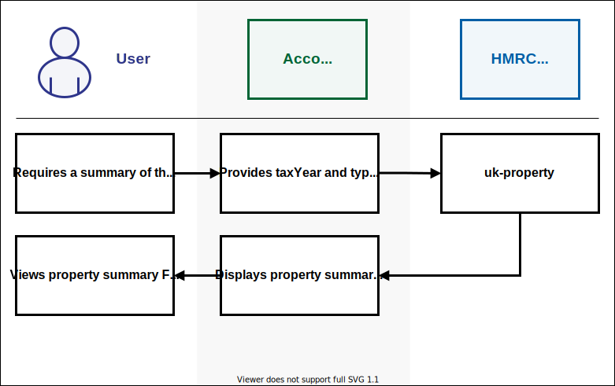

<!--- Section owner: MTD Programme --->

# Business and property income

The steps in this section (up to the End of Period Statement) will be the element that will be mandated for digital record keeping and submission through software under MTD (Making Tax Digital).

## Retrieving obligations

Once a business or agent has completed authentication and granted access to the software, the software can then use our APIs to request the information the customer provided at sign up and to find out the customer’s update obligation dates. The software must make customers aware of their obligations.

Actions to take are as follows:

* the [list all self-employment businesses](https://developer.service.hmrc.gov.uk/api-documentation/docs/api/service/self-assessment-api/2.0#selfemployment-business_list-all-selfemployment-businesses_get_accordion) endpoint provides a list of all the customer’s self-employment businesses, along with the self-employment ID which the software will need to send to HMRC (this is currently limited to one but functionality to add more will be available later and stated in the roadmap)
* the [get a self-employment business](https://developer.service.hmrc.gov.uk/api-documentation/docs/api/service/self-assessment-api/2.0#selfemployment-business_get-a-selfemployment-business_get_accordion) or [get a UK property business](https://developer.service.hmrc.gov.uk/api-documentation/docs/api/service/self-assessment-api/2.0#uk-property-business_get-a-uk-property-business_get_accordion) endpoint will provide the information HMRC holds for a specific self-employment or property business

Customers can find out their obligations for their income source, through the following endpoints:

* [retrieve self-employment business obligations](https://developer.service.hmrc.gov.uk/api-documentation/docs/api/service/self-assessment-api/2.0#selfemployment-business_retrieve-selfemployment-business-obligations_get_accordion) - provides obligation dates for all self-employment businesses, including grace periods and whether obligations have been met or not 
* [retrieve all UK property business obligations](https://developer.service.hmrc.gov.uk/api-documentation/docs/api/service/self-assessment-api/2.0#uk-property-business_retrieve-all-uk-property-business-obligations_get_accordion) endpoint provides obligation dates for their UK property, including grace periods and whether obligations have been met or not 

Note: the obligations for property obligations cover both FHL and non-FHL.

## Submit income and expense updates for self-employment and property businesses

Businesses and agents who represent them, will be required to provide summary-level information of their business income and expenses (transactional information to be kept digitally) on a quarterly basis or more often if they choose.

The quarterly obligations are initially created based on the accounting period for the income source. The deadline for meeting a quarterly obligation is one month after the obligation period end date. The software should present these deadlines clearly to the customer and prompt them to submit information when the update is due. Submissions of summary-level information cannot span an obligation period. If it does, the software will need to send two updates that fall into different obligations.

The software package will need to convert the transactional information into summary totals for each category, for example, expenses by category.

HMRC has provided APIs to enable the software to be able to send the summary information to HMRC for each income source and allow HMRC to provide a calculation based on all the information we have received to date.

When the update is received, HMRC checks if the customer is signed up to MTD, if the submission is coming from an agent and if that agent is subscribed to agent services and authorised to act on behalf of the client if not, an error is returned. 

Note: If you still get the error and the client insists they have met all of the scenarios, check they have used the correct Government Gateway credentials when granting access to the software.

The service will include a number of business validation rules to ensure that all submissions are cross-validated before being accepted. HMRC cannot apply these rules without knowing that no further submission (APIs calls) will be sent by the customer for the period being validated.

Once all the information has been submitted to HMRC for that period, the software must use the [trigger a Self Assessment tax calculation](https://developer.service.hmrc.gov.uk/api-documentation/docs/api/service/individual-calculations-api/1.0#self-assessment_trigger-a-self-assessment-tax-calculation_post_accordion)
endpoint to inform HMRC that the user has finished submitting their information. As a response, HMRC will provide a Calculation ID (calculationId).

The triggering of the tax calculation will mark the obligation as fulfilled, if we have data covering the whole period. 

<a href="figures/submit-periodics.svg" target="blank"></a>

<a href="figures/submit-periodics.svg" target="blank">Open the submit periodics diagram in a new tab</a>.

1. The customer enters digital records through accountancy software or a spreadsheet. The records are uploaded digitally.  MTD mandates that a business keeps digital records for all self-employment and property businesses. 
2. The software calls the list all self-employment businesses endpoint which provides the self-employment ID. You will need to call this the first time your customer uses the software but it's not needed for every interaction.  Note: this is not relevant for a property as there are no property business IDs. 
3. The HMRC API returns the self-employment ID which is required to interact with other self-employment APIs. Note: this is not relevant for a property as there are no property business IDs.
4. The software receives the self-employment ID.  You should store the self-employment ID which will save you having to repeatedly call this endpoint. Note: this is not relevant for a property as there are no property business IDs.
5. The software calls the retrieve Self Employment business obligations or retrieve all UK property business obligations - quarterly obligations are initially created based on the accounting period for the income source. The deadline for meeting a quarterly obligation is one month after the obligation period end date. The software should communicate these deadlines clearly to the customer and prompt them to submit the information when the update is due. 
6. HMRC returns obligations for the requested date range.
7. The software receives the obligations for the requested date range. It can hold on to this information and prompt the customer closer to the due date.
8. The software prompts the customer when they are due to submit an update.
9. The customer receives the prompt in the software.   
10. Software prepares the summary information and displays it to the customer.
11. The customer reviews and submits information.
12. The customer starts the process of submitting data. 
13. The software calls the create a Self Employment periodic update, create a non FHL UK property update period or create a FHL UK property update period endpoints, depending on the income source type being submitting.
14. HMRC receives and stores information and provides success response. 
15. The software receives the success response.
15a. The software confirms with the customer that the update has been received and stored by HMRC. 
16. The software calls the trigger a self-assessment tax calculation endpoint to get the calculation and ensure the obligation is marked as met, once the update(s) complete an obligation period.
17. HMRC marks the obligation as fulfilled, once the update(s) complete an obligation period. Note: that this can take up to an hour to show on our systems as met.
18. HMRC receives the request and returns a Calculation ID (calculationId). Software must use this when calling the Self Assessment tax calculation endpoint. 
19. The software calls the relevant endpoints to retrieve the calculation. Note: the tax calculation can take up to 5 seconds to run.  We recommend you wait 5 seconds – this is optional and the software does not have to retrieve the tax calculation information at this point.
>a) [retrieve a self-assessment tax calculation metadata](https://developer.service.hmrc.gov.uk/api-documentation/docs/api/service/individual-calculations-api/1.0#self-assessment_retrieve-self-assessment-tax-calculation-metadata_get_accordion) endpoint for a given CalculationID – this provides high-level data about the calculation including the calculation type ‘crystallised’ or ‘In Year,’ the total Income Tax and NIC calculated and details of which of the other calculation endpoints are relevant to the calculation, for vexample, if no error messages have been generated during the calculation this endpoint will show you that so you do not need to call that endpoint.<br/>
 >b) [retrieve the calculated Income Tax and National Insurance contributions](https://developer.service.hmrc.gov.uk/api-documentation/docs/api/service/individual-calculations-api/1.0#self-assessment_retrieve-self-assessment-tax-calculation-income-tax-and-nics-calculated_get_accordion) for a given NINO and Calculation ID – this endpoint provides the detail of Income Tax and NICs calculated, including details of the rate bands applied to each income source and any tax deducted at source.<br/>
 >c) [retrieve the taxable income](https://developer.service.hmrc.gov.uk/api-documentation/docs/api/service/individual-calculations-api/1.0#self-assessment_retrieve-self-assessment-tax-calculation-taxable-income_get_accordion) that has been used in the self-assessment tax calculation for a given NINO and Calculation ID – this endpoint provides detail of income across all sources that have formed part of the calculation.<br/>
 >d) [retrieve the allowances, deductions and reliefs](https://developer.service.hmrc.gov.uk/api-documentation/docs/api/service/individual-calculations-api/1.0#self-assessment_retrieve-self-assessment-tax-calculation-allowances-deductions-and-reliefs_get_accordion) that exist for the self-assessment tax calculation for a given NINO and Calculation ID - this endpoints provides the details of all allowances, deductions and reliefs that have been used in the calculation.<br/>
 >e) [retrieve the end-of-year Income Tax and National Insurance contribution](https://developer.service.hmrc.gov.uk/api-documentation/docs/api/service/individual-calculations-api/1.0#self-assessment_retrieve-self-assessment-tax-calculation-income-tax-and-nics-calculated_get_accordion) estimates for a given NINO and Calculation ID – this endpoint provides a forecast of how much Income Tax and NICs could be due for the full year based on the Income submitted for a period.<br/>
 >f) [retrieve 'info', 'warning' and 'error' level messages](https://developer.service.hmrc.gov.uk/api-documentation/docs/api/service/individual-calculations-api/1.0#self-assessment_retrieve-self-assessment-tax-calculation-messages_get_accordion) linked to a Calculation ID – if any validation warnings or errors are generated, this endpoint enables software to find out what those warnings or errors are.<br/>
 
20. HMRC returns tax calculation.
21. The software displays the calculation to the user – this is optional, the software does not have to show the calculation to the customer at this point (some may want to do their own).
22. Customer reviews the tax calculation.

Note:

* The periodic information does not need to be provided in one go. Customers can submit data as frequently as they like, for example, monthly.
* The customer does not have to declare that the submissions are ‘complete and correct’ (there is no ‘accuracy’ statement required at this point), only that the customer must indicate that they do not intend to provide any additional information at this point. There is nothing to stop them from providing additional information anytime by resubmitting the update period with any changes that have been made to the previous submission.
*	In some cases, the obligation can take up to an hour to be confirmed as met. 
*	The met obligation must be presented clearly to the customer in the software. 
*	Businesses can  also check this information in their Business Tax Account. 
*	The customer will not receive any communication from HMRC to confirm that the obligation has been met. The software should provide this confirmation to the customer. For property businesses, an update for either FHL or Non-FHL for the full quarter will mark the obligation as fulfilled, even if they have both income types. 

Each update period cannot overlap the previous one, for example:

Update 1 – 6 April to 1 May is accepted<br />
Update 2 – 2 May to 31 May is accepted<br />
Update 3 – 28 May to 6 June is rejected because it overlaps with previous updates

## Submit allowance and adjustment updates for SE and property businesses

Annual updates are mandatory annually but we have provided the functionality for customers to provide information more frequently if they choose. 

* update a [self-employment annual summary](https://developer.service.hmrc.gov.uk/api-documentation/docs/api/service/self-assessment-api/2.0#selfemployment-business_get-a-selfemployment-annual-summary_get_accordion) - this enables the customer to provide any information about allowances and adjustments they might want to provide during the year to get a more accurate calculation 
* update a [non-FHL property business annual summary](https://developer.service.hmrc.gov.uk/api-documentation/docs/api/service/self-assessment-api/2.0#uk-property-business_amend-a-nonfhl-uk-property-business-annual-summary_put_accordion) - this enables the customer to provide any information about allowances and adjustments they might want to provide during the year to obtain a more accurate calculation 
* update an [FHL property business annual summary](https://developer.service.hmrc.gov.uk/api-documentation/docs/api/service/self-assessment-api/2.0#uk-property-business_amend-a-fhl-uk-property-business-annual-summary_put_accordion) - this enables the customer to provide any information about allowances and adjustments they might want to provide during the year to obtain a more accurate calculation 

## Retrieve a tax calculation 

The software will need to use that Calculation ID when calling each endpoint within the [Individual calculations API](https://developer.service.hmrc.gov.uk/api-documentation/docs/api/service/individual-calculations-api/1.0).

A calculation result once created (excluding metadata) is an immutable calculation that provides a calculation result at a particular point in time. Any further income updates will require a new calculation to be triggered.

The [individual calculations API](https://developer.service.hmrc.gov.uk/api-documentation/docs/api/service/individual-calculations-api/1.0) allows the software to, choose which elements of the tax calculation it wants to retrieve and play back to the customer:

* [list self-assessment tax calculations](https://developer.service.hmrc.gov.uk/api-documentation/docs/api/service/individual-calculations-api/1.0#self-assessment_list-self-assessment-tax-calculations_get_accordion) for a given National Insurance number (NINO) and tax year
* [trigger a self-assessment tax calculation](https://developer.service.hmrc.gov.uk/api-documentation/docs/api/service/individual-calculations-api/1.0#self-assessment_trigger-a-self-assessment-tax-calculation_post_accordion) for a given tax year. The software must use the trigger a self-assessment tax calculation endpoint to inform HMRC that the user has finished submitting their information. As a response, HMRC will provide a Calculation ID (calculationId). 
* The triggering of the tax calculation will mark the obligation as fulfilled, if HMRC has data covering the whole period.
* [retrieve high-level calculation metadata](https://developer.service.hmrc.gov.uk/api-documentation/docs/api/service/individual-calculations-api/1.0#self-assessment_retrieve-self-assessment-tax-calculation-metadata_get_accordion) for a given CalculationID
* [retrieve the calculated Income Tax and National Insurance contributions](https://developer.service.hmrc.gov.uk/api-documentation/docs/api/service/individual-calculations-api/1.0#self-assessment_retrieve-self-assessment-tax-calculation-income-tax-and-nics-calculated_get_accordion) for a given NINO and Calculation ID
* [retrieve the taxable income](https://developer.service.hmrc.gov.uk/api-documentation/docs/api/service/individual-calculations-api/1.0#self-assessment_retrieve-self-assessment-tax-calculation-taxable-income_get_accordion) that has been used in the self-assessment tax calculation for a given NINO and Calculation ID
* [retrieve the allowances, deductions and reliefs](https://developer.service.hmrc.gov.uk/api-documentation/docs/api/service/individual-calculations-api/1.0#self-assessment_retrieve-self-assessment-tax-calculation-allowances-deductions-and-reliefs_get_accordion) that exist for the self-assessment tax calculation for a given NINO and Calculation ID
* [retrieve the end-of-year Income Tax and National Insurance contribution estimates](https://developer.service.hmrc.gov.uk/api-documentation/docs/api/service/individual-calculations-api/1.0#self-assessment_retrieve-self-assessment-tax-calculation-end-of-year-estimate_get_accordion) for a given NINO and Calculation ID
* [retrieve 'info', 'warning' and 'error' level messages](https://developer.service.hmrc.gov.uk/api-documentation/docs/api/service/individual-calculations-api/1.0#self-assessment_retrieve-self-assessment-tax-calculation-messages_get_accordion) linked to a Calculation ID

Notes: 

* it can take around 5 seconds for the tax calculation response to be ready to retrieve, please wait at least 5 seconds before retrieving the calculation or you may get an error
* the self-assessment tax calculation endpoints under the Individual Calculations API will replace the tax calculation endpoints under the existing [Self Assessment API](https://developer.service.hmrc.gov.uk/api-documentation/docs/api/service/self-assessment-api/2.0)
* the endpoints under the existing Self Assessment API will be supported until 31th July 2020, after that only the Individual Calculations API will be supported
* it is possible to return both in-year and crystallisation calculations using these endpoints. An in-year calculation is worked out if the calculation was triggered by the [trigger a self-assessment tax calculation](https://developer.service.hmrc.gov.uk/api-documentation/docs/api/service/individual-calculations-api/1.0#self-assessment_trigger-a-self-assessment-tax-calculation_post_accordion) endpoint

## Making changes to previously submitted data

If a customer wants to make a change to the data that was included in a previously submitted update, customers should make the changes to the digital records and software to recalculate the summary totals and submit to HMRC using the following endpoints:

### For income and expense updates (quarterly)

If a customer makes a change to a previously submitted periodic update, we suggest you call the following:

* [list Self Employment Update periods](https://developer.service.hmrc.gov.uk/api-documentation/docs/api/service/self-assessment-api/2.0#selfemployment-business_list-all-selfemployment-update-periods_get_accordion)
* [list all non FHL update periods](https://developer.service.hmrc.gov.uk/api-documentation/docs/api/service/self-assessment-api/2.0#uk-property-business_list-all-nonfhl-uk-property-update-periods_get_accordion) or [list all FHL update](https://developer.service.hmrc.gov.uk/api-documentation/docs/api/service/self-assessment-api/2.0#uk-property-business_list-all-fhl-uk-property-update-periods_get_accordion) periods (depending on business income type) to get the period ID and check the update period date range, to ensure any changes are made to the exact date range otherwise it will be rejected.

The software will have to recreate the update period including the new summary totals and resubmit the specific update period, using the following:

* [amend a self employment periodic update](https://developer.service.hmrc.gov.uk/api-documentation/docs/api/service/self-assessment-api/2.0#selfemployment-business_amend-a-selfemployment-periodic-update_put_accordion) 
* [amend a non FHL UK property periodic update](https://developer.service.hmrc.gov.uk/api-documentation/docs/api/service/self-assessment-api/2.0#uk-property-business_amend-a-nonfhl-uk-property-periodic-update_put_accordion) or [amend a FHL UK property periodic update](https://developer.service.hmrc.gov.uk/api-documentation/docs/api/service/self-assessment-api/2.0#uk-property-business_amend-a-fhl-uk-property-periodic-update_put_accordion) depending on the business income type.

When a business resubmits an update period, the software will have to use the trigger a calculation endpoint and follow the same process as the submitting an update period process.

### For allowance and adjustment updates (annual)

Use the same endpoints and process for submitting annual information as mentioned.

* [amend a self-employment annual summary](https://developer.service.hmrc.gov.uk/api-documentation/docs/api/service/self-assessment-api/2.0#selfemployment-business_amend-a-selfemployment-annual-summary_put_accordion)
* [amend a non-FHL UK property business annual summary](https://developer.service.hmrc.gov.uk/api-documentation/docs/api/service/self-assessment-api/2.0#uk-property-business_amend-a-nonfhl-uk-property-business-annual-summary_put_accordion)
* [amend a FHL UK property business annual summary](https://developer.service.hmrc.gov.uk/api-documentation/docs/api/service/self-assessment-api/2.0#uk-property-business_amend-a-fhl-uk-property-business-annual-summary_put_accordion)

Note: where a business resubmits an annual summary update, previous figures that have been submitted must be sent again as well as any additional information. A zero or empty filed will overwrite previously provided information. The software will have to use the trigger a calculation endpoint and follow the same process.

### Key points for changing previously submitted updates

* changes to periodic updates - the update period you are trying to change must match the original update period exactly, or it will be rejected
* changes to annual updates - all figures previously supplied must be provided again, a zero or a null will overwrite any previously submitted information


## Finalise business income End of Period Statement (EOPS)

### Business or Agent able to submit End of Period Statement through software

This is the process that allows the customer to finalise the profit or loss for any one source of business income. An EOPS must be completed for each source of business income the taxpayer has (just as, the current Income Tax process for the SA103 and 105 schedules) so, for example, if a customer has one self-employment business and one property business they will have to complete two EOPS.

EOPS relates to the accounting period or basis period for each source of business income and cannot be completed before the end of that period. Customers can complete their EOPS at any point after the end of the accounting period and do not have to wait until the 31 January deadline. We would like to encourage this behaviour where possible as it helps customers manage their business income in line with the business accounts. However, the deadline to complete is 31 January, Year 2. 

The process will take into account all the periodic and annual data already provided by the customer throughout the year.

Customers must make sure they are confident with the information they have provided and add any additional information they have. This is likely to include tax and accounting adjustments, allowances or reliefs.

<a href="figures/eops.svg" target="blank"></a>
<a href="figures/eops.svg" target="blank">Open the EOPS diagram in a new tab</a>.

1. The customer inputs information about allowances and adjustments for the business
income source. They can provide this information throughout the year, but must do it
before they complete the EOPS.
2. The software calls the [Get a self-employment annual summary](https://developer.service.hmrc.gov.uk/api-documentation/docs/api/service/self-assessment-api/2.0#selfemployment-business_get-a-selfemployment-annual-summary_get_accordion), [Get a non FHL UK property business annual summary](https://developer.service.hmrc.gov.uk/api-documentation/docs/api/service/self-assessment-api/2.0#uk-property-business_get-a-nonfhl-uk-property-business-annual-summary_get_accordion)
or [Get a FHL UK property business annual summary](https://developer.service.hmrc.gov.uk/api-documentation/docs/api/service/self-assessment-api/2.0#uk-property-business_get-a-fhl-uk-property-business-annual-summary_get_accordion), depending on the business income type you need to submit. This step is optional, but we recommend it to ensure you are getting the most up-to-date information.
3. The customer views the allowances and adjustment information and updates relevant information.
4. The software submits information using the [Amend a self-employment annual summary](https://developer.service.hmrc.gov.uk/api-documentation/docs/api/service/self-assessment-api/2.0#selfemployment-business_amend-a-selfemployment-annual-summary_put_accordion),
[Amend a non FHL UK property business annual summary](https://developer.service.hmrc.gov.uk/api-documentation/docs/api/service/self-assessment-api/2.0#uk-property-business_amend-a-nonfhl-uk-property-business-annual-summary_put_accordion) or [Amend a FHL UK Property business annual summary](https://developer.service.hmrc.gov.uk/api-documentation/docs/api/service/self-assessment-api/2.0#uk-property-business_amend-a-fhl-uk-property-business-annual-summary_put_accordion). Depending on the business income type you need to update.
5. HMRC receives and stores information
6. The software calls the [Trigger a self-assessment tax calculation](https://developer.service.hmrc.gov.uk/api-documentation/docs/api/service/individual-calculations-api/1.0#self-assessment_trigger-a-self-assessment-tax-calculation_post_accordion) endpoint to get the calculation
7. HMRC receives the request and returns a Calculation ID (calculationId) software must
use this when calling the Self Assessment Tax Calculation endpoints.
8. The software receives the calculationId. Note: you could display the calculation to customers at
this point if you choose, if you do follow steps 20 and 21 in the periodic update section.
9. The customer wants to make some accounting adjustments following the business accounts
being finalised.
10. The software calls the SA Accounting summary API (currently in development).
11. HMRC returns summary totals of all the information for that business income source.
12. The software displays information to the customer.
13. The customer makes adjustments, confirms and submits.
14. The software sends information to HMRC using the SA Accounting summary API (currently in
development).
15. HMRC confirms receipt and stores the information.
16. The software calls the relevant endpoints to retrieve the calculation. Note: the Tax
Calculation can take up to 5 seconds to run, so we recommend the software waits 5 seconds – this is optional, the software does not have to retrieve the tax calculation information at this point.
>a. [retrieve a self-assessment tax calculation metadata](https://developer.service.hmrc.gov.uk/api-documentation/docs/api/service/individual-calculations-api/1.0#self-assessment_retrieve-self-assessment-tax-calculation-metadata_get_accordion) endpoint for a given
CalculationID – this will provide high-level data about the calculation including
the calculation type ‘crystallised’ or ‘In Year’, the total Income Tax and NIC
calculated, and details of which of the other calculation endpoints are relevant to that
calculation. For example, if no messages have been generated during the
calculation, this end point will show you that, so you do not need to call that endpoint.</br>
>b. [retrieve the calculated Income Tax and National Insurance contributions](https://developer.service.hmrc.gov.uk/api-documentation/docs/api/service/individual-calculations-api/1.0#self-assessment_retrieve-self-assessment-tax-calculation-income-tax-and-nics-calculated_get_accordion) for a
given NINO and Calculation ID – This endpoint provides the detail of Income Tax
and NICs calculated, including detail of the rate bands applied to each income
source and any tax deducted at source.</br>
>c. [retrieve the taxable income](https://developer.service.hmrc.gov.uk/api-documentation/docs/api/service/individual-calculations-api/1.0#self-assessment_retrieve-self-assessment-tax-calculation-taxable-income_get_accordion) that has been used in the self-assessment tax
calculation for a given NINO and Calculation ID – this end point provides detail
of income across all sources that have formed part of the calculation.</br>
>d. [retrieve the allowances, deductions and reliefs](https://developer.service.hmrc.gov.uk/api-documentation/docs/api/service/individual-calculations-api/1.0#self-assessment_retrieve-self-assessment-tax-calculation-allowances-deductions-and-reliefs_get_accordion) that exist for the self-assessment
tax calculation for a given NINO and Calculation ID - this end points provides
the details of all allowances, deductions and reliefs that have been used in the
calculation.</br>
>e. [retrieve the end-of-year Income Tax and National Insurance contribution
estimates](https://developer.service.hmrc.gov.uk/api-documentation/docs/api/service/individual-calculations-api/1.0#self-assessment_retrieve-self-assessment-tax-calculation-end-of-year-estimate_get_accordion) for a given NINO and Calculation ID – This end point provides a
forecast of how much Income Tax and NICs could be due for the full year based
on the Income submitted for a period</br>
>f. [retrieve 'info', 'warning' and 'error' level messages](https://developer.service.hmrc.gov.uk/api-documentation/docs/api/service/individual-calculations-api/1.0#self-assessment_retrieve-self-assessment-tax-calculation-messages_get_accordion) linked to a Calculation ID –
If any validation warnings or errors are generated this endpoint enables software to find out what those warnings or errors are.</br>

17. The software displays the calculation to the user – this is optional software does not have to show the calculation to the customer at this point.
18. The customer is ready to finalise their business income source.
19. The software calls the [Get Self Employment business income source summary](https://developer.service.hmrc.gov.uk/api-documentation/docs/api/service/self-assessment-api/2.0#selfemployment-business_get-selfemployment-business-income-source-summary-biss_get_accordion) or [Get UK property business income source summary](https://developer.service.hmrc.gov.uk/api-documentation/docs/api/service/self-assessment-api/2.0#uk-property-business_get-uk-property-business-income-source-summary-biss_get_accordion) depending on the business income type you are finalising. Note: there is only one BISS for a property, it will show both FHL and Non-FHL information in it. Calling the BISS API is optional, the software may choose to create a BISS themselves, but the information must be shown to the customer before they confirm the declaration.
20. The software displays BISS (Business Income Source Summary) information to the customer (listed below).</br>
>This can be totalled up by software, or through the APIs from HMRC systems as well as BISS for self-employment or property:
>
>Total Business Income<br/>
>Total Expenses<br/>
>Business Net Profit<br/>
>Business Net Loss<br/>
>Total Additions to net profit or deductions to a net loss<br/>
>Total Deductions to net profit or additions to a net loss<br/>
>Accounting Adjustments<br/>
>Taxable Profit<br/>
>Taxable Loss<br/>
>
>This information must be shown to the customer for them to confirm it is complete and correct for that source of business income before they send the declaration.</br>
>
>You could use the BISS API or opt to create this information within your package. HMRC will need the declaration to confirm the customer has seen it.

21. Customer reviews and confirms the information.
22. The software uses submit self-employment end of period statement or submit UK property.
end of period statement endpoints depending on the income source you are finalising. Note: there is only one property EOPS which covers the property BISS.
23. HMRC receives the declaration and marks the obligation as met and provides a success response.
24. The software receives the success response.
25. The software confirms with the customer that the update has been received and stored by
HMRC.

Note:	data received must cover the whole accounting period.

The declaration is the only mandatory requirement for this process, the exact text that HMRC requires you to present is below. 

Developers must replace '[insert tax year]' with the correct tax year.

### Declaration for Agents

 > **Declaration for Self Employment EOPS**
 
> "I confirm that my client has reviewed the information provided to establish the taxable profits for the relevant period ending in [insert tax year] together with the designatory data provided for that period and that it is correct and complete to the best of their knowledge. They understand that they may have to pay financial penalties or face prosecution if they give false information."

 > **Declaration for Property EOPS**

> "I confirm that my client has reviewed the information provided to establish taxable profits for the relevant period ending in [insert tax year] together with the designatory data for that period and that it is correct and complete to the best of their knowledge. They understand that they may have to pay financial penalties or face prosecution if they give false information."


### Declaration for Individuals

 > **Declaration for Self Employment EOPS**
 
> “I confirm that I have reviewed the information provided to establish the taxable profits for the relevant period ending in [insert tax year] together with the designatory data provided for that period and that it is correct and complete to the best of my knowledge. I understand that I may have to pay financial penalties or face prosecution if I give false information.”

> **Declaration for Property EOPS**

> “I confirm that I have reviewed the information provided to establish taxable profits for the relevant period ending in [insert tax year] together with the designatory data for that period and that it is correct and complete to the best of my knowledge. I understand that I may have to pay financial penalties or face prosecution if I give false information.”

Making changes to previously submitted data during and after an EOPS declaration:

* if the information the customer has previously provided relating to that source of business income is not correct or complete (for example the previous information provided fails further validation, or a periodic update is missing), then the EOPS declaration is rejected, and error messages are returned. The changes must be made to any relevant periodic or annual summaries and then follow the existing process of submitting updates and triggering the calculation before attempting the declaration again.

* if there are no error failures, it is recommended that customers review any warning messages they have at this point or earlier as warnings will cause a failure at crystallisation.

* if after the customer has completed their EOPS declaration, they need to revise any of the data relating to that source of business income then they must make the change to the relevant periodic or annual summaries and follow the existing process of submitting updates and triggering the calculation.

Note: making changes to data for previously submitted periods is covered in the "[make changes to previously submitted data"](https://developer.service.hmrc.gov.uk/guides/income-tax-mtd-end-to-end-service-guide/documentation/businessandpropertyincome.html#make-changes-to-previously-submitted-data) section.

## View previously submitted updates

A customer may want to retrieve previously submitted data, for example before making a change the customer may want to request the last update provided before sending in any changes. If the customer has recently started using your software, you may need to retrieve previous data.

### Income and expense updates (Periodic) 

The software can use the list all self-employment or property update periods endpoints to retrieve the list of updates made for that income source, or to find one or more period IDs. The period ID is then used with the ‘get a self-employment/property (FHL or Non FHL) periodic update’ endpoint to retrieve data for that update.

### Annual accounting adjustments

Within the annual self-assessment process, annual accounting adjustments are applied to income and expenses before the business or agent submits their tax return to HMRC. Within Making Tax Digital as the income and expenses are submitted to HMRC at least quarterly
during the active accounting period, this means a new process to accommodate these adjustments is required.

### Submitting annual accounting adjustments

After an accounting period has ended, a business or agent may need to submit accounting adjustments to the income and expenses that have been submitted throughout the year.

Endpoints to call are:

1. Trigger a Business source adjustable summary.
2. Retrieve a Self-employment business source adjustable summary (BSAS) or Retrieve a UK property business
source adjustable summary - this endpoint provides the totals of all income and expenses submitted for that business that can have adjustments applied to them.
3. Apply the adjustments as appropriate to the total figures returned via the Retrieve BSAS endpoint.
4. Submit accounting adjustments self-employment or accounting adjustments UK property.

Once submitted, if a further amendment is required to use the Retrieve self-employment accounting adjustments or Retrieve UK property adjustments endpoints to retrieve the previously submitted data and then repeat steps 3 and 4.

## Business Income Source Summary

The Self Assessment BISS (Business Income Source Summary) API allows a developer to retrieve a summary of income and expenditure that has been submitted for a specified self-employment or UK property business for a given tax year. The data returned is the equivalent of the existing SA103 and SA105 schedule.
 
<a href="figures/biss.svg" target="blank"></a>

<a href="figures/biss.svg" target="blank">Open the BISS diagram in a new tab</a>.
 
* [retrieve a self-employment business income source summary (BISS)](https://developer.service.hmrc.gov.uk/api-documentation/docs/api/service/self-assessment-biss-api/1.0#_retrieve-a-selfemployment-business-income-source-summary-biss_get_accordion)
* [retrieve a UK property business income source summary (BISS)](https://developer.service.hmrc.gov.uk/api-documentation/docs/api/service/self-assessment-biss-api/1.0#_retrieve-a-uk-property-business-income-source-summary-biss_get_accordion)
 
## Business Source Adjustable Summary

The Self Assessment BSAS (Business Source Adjustable Summary) API allows a developer to retrieve an adjustable summary calculation for a specified self-employment or UK property business, for a given accounting period.

This API should be used to submit any Annual Accounting Adjustments. The adjustments should be submitted as positive or negative amounts, for example, if advertising costs in the BSAS is £250 but the figure should be £200, then the adjustment required would be -50.
 
<a href="figures/bsas.svg" target="blank"></a>

<a href="figures/bsas.svg" target="blank">Open the BSAS diagram in a new tab</a>.

* [List Business Source Adjustable Summaries (BSAS)](https://developer.service.hmrc.gov.uk/api-documentation/docs/api/service/self-assessment-bsas-api/1.0#_list-business-source-adjustable-summaries-bsas-test-only_get_accordion)
* [Trigger a Business Source Adjustable Summary (BSAS) - Test only](https://developer.service.hmrc.gov.uk/api-documentation/docs/api/service/self-assessment-bsas-api/1.0#_trigger-a-business-source-adjustable-summary-bsas_post_accordion)

* [Retrieve a Self-Employment Business Source Adjustable Summary (BSAS)](https://developer.service.hmrc.gov.uk/api-documentation/docs/api/service/self-assessment-bsas-api/1.0#selfemployment-business_retrieve-a-selfemployment-business-source-adjustable-summary-bsas_get_accordion)
* [Retrieve a Self-Employment Business' Summary Adjustments](https://developer.service.hmrc.gov.uk/api-documentation/docs/api/service/self-assessment-bsas-api/1.0#selfemployment-business_retrieve-a-selfemployment-business-summary-adjustments_get_accordion)
* [Submit an Adjustment to a Self-Employment Business Summary](https://developer.service.hmrc.gov.uk/api-documentation/docs/api/service/self-assessment-bsas-api/1.0#selfemployment-business_submit-an-adjustment-to-a-selfemployment-business-summary_post_accordion)
* [Retrieve a UK Property Business Source Adjustable Summary (BSAS)](https://developer.service.hmrc.gov.uk/api-documentation/docs/api/service/self-assessment-bsas-api/1.0#uk-property-business_retrieve-a-uk-property-business-source-adjustable-summary-bsas_get_accordion)
* [Retrieve a UK Property Business' Summary Adjustments](https://developer.service.hmrc.gov.uk/api-documentation/docs/api/service/self-assessment-bsas-api/1.0#uk-property-business_retrieve-a-uk-property-business-summary-adjustments_get_accordion)
* [Submit an Adjustment to a UK Property Business Summary](https://developer.service.hmrc.gov.uk/api-documentation/docs/api/service/self-assessment-bsas-api/1.0#uk-property-business_submit-an-adjustment-to-a-uk-property-business-summary_post_accordion)

## Payments and Liabilities
 
The Self Assessment Account API allows a developer to retrieve accounting information to be shown back to the customer. This includes listing payments the customer has made, how these payments have been allocated and details of any upcoming or outstanding liabilities. Here a developer can:

* retrieve the overall liability broken down into overdue, payable and pending amounts
* retrieve a list of charges and payments for a given date range
* list self-assessment charges between two dates
* retrieve the history of changes to an individual charge
* retrieve a list of payments for a given date range
* retrieve the allocation details of a specific payment against one or more liabilities

<a href="figures/payments-and-liabilities-rsab.svg" target="blank"></a>

<a href="figures/payments-and-liabilities-rsab.svg" target="blank">Open the Retrieve a Self Assessment Balance diagram in a new tab</a>.

[Retrieve a Self Assessment Balance [test only]](https://developer.qa.tax.service.gov.uk/api-documentation/docs/api/service/self-assessment-accounts-api/1.0#_retrieve-a-self-assessment-balance-test-only_get_accordion) This endpoint allows a developer to retrieve the overall liability broken down into overdue, currently due (payable) and pending (not yet due) amounts. A unique identifier (National Insurance number) for the account must be used.

<a href="figures/payments-and-liabilities-lsat.svg" target="blank"></a>

<a href="figures/payments-and-liabilities-lsat.svg" target="blank">Open the List Self Assessment Transactions diagram in a new tab</a>.
 
[List Self Assessment Transactions [test only]](https://developer.qa.tax.service.gov.uk/api-documentation/docs/api/service/self-assessment-accounts-api/1.0#_list-self-assessment-transactions-test-only_get_accordion)  This endpoint allows a developer to retrieve a list of charges and payments for a given date range. The developer must quote a unique identifier (National Insurance number) for the account and provide a search period.

<a href="figures/payments-and-liabilities-lsac.svg" target="blank"></a>

<a href="figures/payments-and-liabilities-lsac.svg" target="blank">Open the List Self Assessment Charges diagram in a new tab</a>.

[List Self Assessment Charges [test only]](https://developer.qa.tax.service.gov.uk/api-documentation/docs/api/service/self-assessment-accounts-api/1.0#_retrieve-a-self-assessment-transactions-detail-test-only_get_accordion)  This endpoint allows a developer to retrieve the details of charges made to an account between two dates. The developer must use a unique identifier for the account (National Insurance number) and provide a valid date range.

<a href="figures/payments-and-liabilities-rsach.svg" target="blank"></a>

<a href="figures/payments-and-liabilities-rsach.svg" target="blank">Open the Retrieve a Self Assessment Charge's History diagram in a new tab</a>.

[Retrieve a Self Assessment Charge's History [test only]](https://developer.qa.tax.service.gov.uk/api-documentation/docs/api/service/self-assessment-accounts-api/1.0#_retrieve-a-self-assessment-charges-history-test-only_get_accordion)  This endpoint allows a developer to retrieve the history of changes to an individual charge. The user must quote a unique identifier (National Insurance number) for the account and also the charge identifier.

<a href="figures/payments-and-liabilities-rsap.svg" target="blank"></a>

<a href="figures/payments-and-liabilities-rsap.svg" target="blank">Open the List Self Assessment Payments diagram in a new tab</a>.

[List Self Assessment Payments [test only]](https://developer.qa.tax.service.gov.uk/api-documentation/docs/api/service/self-assessment-accounts-api/1.0#_list-self-assessment-payments-test-only_get_accordion)  This endpoint allows a developer to retrieve a list of payments for a given date range. The developer must use a unique identifier for the account (National Insurance number) and provide a date range.

<a href="figures/payments-and-liabilities-rsapad.svg" target="blank"></a>

<a href="figures/payments-and-liabilities-rsapad.svg" target="blank">Open the Retrieve a Self Assessment Payment's Allocation Details diagram in a new tab</a>.

[Retrieve a Self Assessment Payment's Allocation Details [test only]](https://developer.qa.tax.service.gov.uk/api-documentation/docs/api/service/self-assessment-accounts-api/1.0#_retrieve-a-self-assessment-payments-allocation-details-test-only_get_accordion)  This endpoint allows a developer to retrieve the allocation details of a specific payment against one or more liabilities. The unique identifier must be used for both the account (National Insurance number) and the payment (Payment Reference).

## Multiple businesses

Users with multiple self-employment businesses and those with a foreign property business will be able to sign up to Making Tax Digital. To enable this we are providing a number of new endpoints:

* List All Businesses - returns a list of the business income sources
* Retrieve Business Details - returns further information about a single business income source
* Retrieve Income Tax (Self Assessment) Income and Expenditure Obligations - returns the quarterly obligations for each business income source
* Retrieve Income Tax (Self Assessment) End of Period Statement Obligations - returns the End of Period Statement obligations for a user’s business income sources
* Retrieve Income Tax (Self Assessment) Crystallisation Obligations - returns the Crystallisation obligation for a user
* Amend Loss Claim Order Preference - permits a change in the order in which loss claims are consumed 

<a href="figures/list-all-businesses.svg" target="blank"></a>
<a href="figures/list-all-businesses.svg" target="blank">Open the list all businesses diagram in a new tab</a>.

<a href="figures/retrieve-business-details.svg" target="blank"></a>
<a href="figures/retrieve-business-details.svg" target="blank">Open the retrieve details businesses diagram in a new tab</a>.

<a href="figures/multiple-businesses-retrieve-itsa-eops-statement.svg.svg" target="blank"></a>
<a href="figures/multiple-businesses-retrieve-itsa-eops-statement.svg" target="blank">Open the retrieve income tax (Self Assessment) End of Period statement obligations diagram in a new tab</a>.

<a href="figures/retrieve-income-tax-crystallisation-obligations.svg" target="blank"></a>
<a href="figures/rretrieve-income-tax-crystallisation-obligations.svg" target="blank">  Open the retrieve income tax crystallisation obligations diagram in a new tab.</a>.


The List Loss Claims endpoint has been extended to include a sequence number that shows the order in which loss claims will be used.
 
A user with multiple businesses may choose to list their businesses so that they can obtain the Business IDs of their active businesses. A developer can then return information about a specific business or retrieve obligations quoting a ```businessID```, so the user knows when they need to submit information.
  
Where more than one business income source has incurred a loss at the end of the tax year and the user has opted to carry-sideways these losses (by listing loss claims) they will see the current order in which these loss claims will be applied.  If they wish to change the order they can amend the loss claim order preference and list loss claims to review.

Not all loss claims will have a sequence number to indicate the order of use (currently only carry-sideways, future functionality will enable you to carry backwards). When changing the order, all the loss claims of the same type (for example carry-sideways) must be included in the submission.

To obtain the ```businessID``` a developer will need to call the List All businesses endpoint.  This will then permit obligations to be retrieved for a particular Business ID so that the user is clear by when they must submit their business data.
Once loss claims have been generated a user will be able to list them and determine if the order in which they are used needs to change.

<!---
## Additional income
### Investments
This set of endpoints allows a user to manage data related to reliefs on investments.  The user can submit details of investment reliefs for a specific tax year, as well as amend submissions already made.   Additionally, the user can delete previous submissions, and retrieve data previously submitted. 
The new functionality provides three new endpoints, to submit or amend new investment reliefs, delete a submission, or retrieve details of a submission.
[INSERT ACTUAL LINKS HERE]
* Amend /individuals/reliefs/investment/{nino}/{taxYear}
* Delete individuals/reliefs/investment/{nino}/{taxYear}
* Retrieve individuals/reliefs/investment/{nino}/{taxYear}
--->
