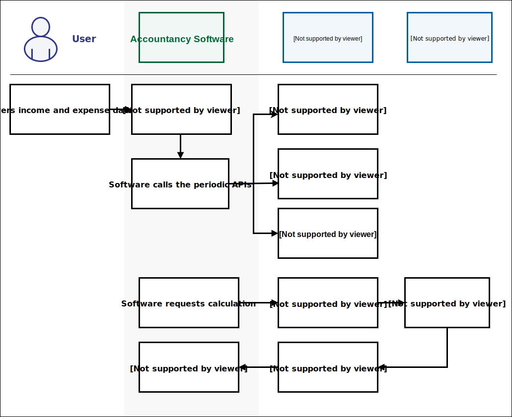

<!--- Section owner: MTD Programme --->

# Making updates during the tax year

## MTD mandated income

A customer’s MTD mandated income consists of the following:

- self-employed sole trader income
- property income

This is the ‘qualifying’ income HMRC uses to establish if the customer meets the criteria for MTD. MTD Customers can have one, or multiple, businesses with these types of income. For more information about qualifying income, refer to [Check what is included in your qualifying income (GOV.UK)](https://www.gov.uk/guidance/check-if-youre-eligible-for-making-tax-digital-for-income-tax#check-what-is-included-in-your-qualifying-income).

### Self-employed sole trader income

If the customer is working for themselves, they are a sole trader. For more information about identifying self-employed sole traders, refer to [Working for yourself (GOV.UK)](https://www.gov.uk/working-for-yourself?step-by-step-nav=01ff8dbd-886a-4dbb-872c-d2092b31b2cf). Currently, self-employment income refers to sole trader self-employment income and not income earned through partnerships. This exclusion also applies to directors of limited companies.

### Property income

A customer’s property income includes the following:

- rental income and other receipts from UK land or property
- rental income and other receipts from foreign land or property
- income from letting furnished rooms in customer’s own home
- income from furnished holiday lettings (FHL) and non-furnished holiday lettings (non-FHL) in the UK
- premiums from leasing UK land
- inducements to take an interest in letting a property (a reverse premium)

For more information about property income, refer to [Work out your rental income when you let property (GOV.UK)](https://www.gov.uk/guidance/income-tax-when-you-rent-out-a-property-working-out-your-rental-income).

## Showing customers their obligations

An MTD mandated or voluntary customer will have a set of obligations for each tax year. These are:

- four quarterly updates
- final declaration 

At any time of the year, customers can check their obligations. To provide this information, the software needs details about their business income sources. It gets this information by using the [List All Businesses](https://developer.service.hmrc.gov.uk/api-documentation/docs/api/service/business-details-api/1.0/oas/page#/paths/~1individuals~1business~1details~1%7Bnino%7D~1list/get) endpoint, which provides the business ID. This ID is required to call multiple self-employment and property endpoints. To save time, the software should store this ID instead of making extra calls.

Quarterly obligations are created for sole trader and property income sources. In software, the retrieval of customer’s obligations is done by calling any of the following endpoints depending on the customer’s type of income source:

- [Retrieve Income Tax (Self Assessment) Income and Expenditure Obligations](https://developer.service.hmrc.gov.uk/api-documentation/docs/api/service/obligations-api/2.0/oas/page#/paths/~1obligations~1details~1%7Bnino%7D~1income-and-expenditure/get)
- [Retrieve Income Tax (Self Assessment) Final Declaration Obligations](https://developer.service.hmrc.gov.uk/api-documentation/docs/api/service/obligations-api/2.0/oas/page#/paths/~1obligations~1details~1%7Bnino%7D~1crystallisation/get)

These endpoints provide obligation dates for all self-employment and property businesses, and inform whether or not obligations have been met. The deadline for meeting a quarterly obligation is one month after the obligation period end date. The software should communicate these deadlines clearly to the customer and prompt them to submit the information when the update is due. 

After submitting a quarterly update or a final declaration, it may take up to an hour for the obligation to be marked as fulfilled in HMRC's system. 

A customer should always be able to view their latest obligations. To do this, the software should be aware that the customer’s obligation will be created or updated for the following reasons:

- start of financial year
- when a customer submits updates
- when a customer adds a new sole trader business in [HMRC online services]( /guides/income-tax-mtd-end-to-end-service-guide/documentation/tasks-outside-mtd-software.html#hmrc-online-services)
- when a customer ceases an existing business in HMRC online services

## Change to calendar quarters

From the tax year 2024 to 2025, accounting periods that run from 1 April to 31 March will be treated as equivalent to 6 April to 5 April. This removes the need for customers to make small adjustments of a few days to determine their profit or loss for the tax year.

As a result, customers with an accounting period that starts on 1 April (rather than 6 April) and ends on 31 March will have the opportunity to change their quarterly updates to also start at the beginning of the month. Although all MTD customers or their agents will be able to make this change through their software regardless of their accounting period, only customers with accounting periods starting on 1 April will benefit. Consequently, the software must avoid allowing customers with accounting periods other than 1 April to 31 March to make this change.

The following table shows an example.

| Quarterly update | Calendar quarterly period |
| ---------------- | ------------------------- |
| 1                | 1 April to 30 June        |
| 2                | 1 July to 30 September    |
| 3                | 1 October to 31 December  |
| 4                | 1 January to 31 March     |

By default, a customer’s quarterly updates will be set automatically to standard quarters. If they wish to change to calendar quarterly updates, they must do this through their software. This cannot be done through HMRC online services. The software must make this option available to customers before they submit their first quarterly update. This is because after submitting the first quarterly update for a tax year, the customer cannot change the quarters for that tax year.

However, if the customer is signing up to MTD late in the tax year, they can still make this change as long as it is before their first quarterly update. This change will have no effect on the update deadlines.

To allow a customer to change their periods to calendar quarters, the software should use the [Create and Amend Quarterly Period Type for a Business](https://developer.service.hmrc.gov.uk/api-documentation/docs/api/service/business-details-api/1.0/oas/page#/paths/~1individuals~1business~1details~1{nino}~1{businessId}~1{taxYear}/put) endpoint. The software should use the [Obligations API](/api-documentation/docs/api/service/obligations-api/) to access the new calendar quarterly periods. 

In the first year of a calendar quarter, the first quarterly period starts on 6 April and ends on 30 June. As a result, customers with a 1 April to 31 March accounting period will need to ensure that income and expenses for the period from 1 April to 5 April are also submitted so that their liability can be assessed accurately for the full tax year equivalent period. 

Consider the following example:

- the customer uses their software to make the change to calendar quarters before their first quarterly update - in software, this is done by using the [Create and Amend Quarterly Period Type for a Business](https://developer.service.hmrc.gov.uk/api-documentation/docs/api/service/business-details-api/1.0/oas/page#/paths/~1individuals~1business~1details~1{nino}~1{businessId}~1{taxYear}/put) endpoint
- the software then calls the [Obligations API](/api-documentation/docs/api/service/obligations-api/) , which shows the customer’s new calendar quarterly updates as follows

    | Quarterly update | Calendar quarterly period |
    | ---------------- | ------------------------- |
    | 1                | 6 April to 30 June        |
    | 2                | 1 July to 30 September    |
    | 3                | 1 October to 31 December  |
    | 4                | 1 January to 31 March     |

- the change affects the first period of the first year and starts from 6 April because that is the first day of the tax year - the first period for subsequent tax years starts on 1 April 
- the customer uses the steps described in [Submit quarterly update](#submit-quarterly-update) to submit their calendar quarterly updates through their software
- when all calendar quarterly updates have been made, the customer needs to account for the income and expense information for the period to 5 April - they can do this through their software by using the [Business Source Adjustable Summary API](/api-documentation/docs/api/service/self-assessment-bsas-api/)

After the calendar quarterly election change has been made, it will continue year on year until the customer requests a change back to standard quarterly updates. The software can use the [Create and Amend Quarterly Period Type for a Business](https://developer.service.hmrc.gov.uk/api-documentation/docs/api/service/business-details-api/1.0/oas/page#/paths/~1individuals~1business~1details~1{nino}~1{businessId}~1{taxYear}/put) endpoint to allow a customer to change their periods back to standard quarters. Each year the customer makes these changes, the first period start date will be affected and will reflect the previous quarterly update type.

## How to submit and view in-year updates

MTD mandated and voluntary customers must maintain and submit digital records of their self-employment and property business income and expenses every quarter. If they wish, they can also submit summary-level information more frequently, for example, monthly.

Customers must submit at least one update for each quarter. The following table shows an example.

| Update | Quarter(s) | Result |
| ------ | ---------- | ------ |
| 1 | 1 | 6 April to 5 July is accepted |
| 2 | 2 | 6 July to 5 October is accepted |
| 3 | 3, 4 | 6 October to 5 April is accepted with a possible penalty |

### Submit quarterly update

The software should convert transactional information into summary totals. It should categorise these totals as income or expenses. It should send this summary information to HMRC for each self-employment and property income source. HMRC can then use this information to calculate business profits based on the most recent data.

Customers with an annual turnover (sales) of less than £90,000 can report their total income and expenses in their quarterly updates (no detailed breakdown required). They can do this through the software by using the ‘Consolidated Expenses’ parameter in the [Self-Employment Business](https://developer.service.hmrc.gov.uk/api-documentation/docs/api/service/self-employment-business-api/3.0) and [Property Business](https://developer.service.hmrc.gov.uk/api-documentation/docs/api/service/property-business-api/4.0) APIs for both self-employment and property income.

When the tax calculation is triggered, it means that the quarterly obligation has been fulfilled, if the data covers the entire period. It may take up to an hour for the obligation to be marked as fulfilled in HMRC's system. If the calculation fails, the obligation will not be marked as fulfilled. Customers can also use [HMRC online services](/guides/income-tax-mtd-end-to-end-service-guide/documentation/tasks-outside-mtd-software.html#hmrc-online-services) to check the status of their [obligations](#showing-customers-their-obligations). 

<a href="figures/submit-periodics.svg" target="blank">Open the submit periodics diagram in a new tab</a>.

### User journey

1. The software prompts the customer when they need to submit an update. This prompt will not be sent from any API.

2. The customer receives the prompt in the software and begins their submission process.

3. Software prepares the summary information and displays it to the customer.

4. The customer checks the information and submits it.

5. The software initiates the data submission process by calling one of the following endpoints, depending on the income source type being submitted:
   - [Create a Self-Employment Period Summary](https://developer.service.hmrc.gov.uk/api-documentation/docs/api/service/self-employment-business-api/3.0/oas/page#tag/Self-Employment-Period-Summaries/paths/~1individuals~1business~1self-employment~1{nino}~1{businessId}~1period/post)
   - [Create a UK Property Income and Expenses Period Summary](https://developer.service.hmrc.gov.uk/api-documentation/docs/api/service/property-business-api/4.0/oas/page#tag/UK-Property-Income-and-Expenses-Period-Summary/paths/~1individuals~1business~1property~1uk~1{nino}~1{businessId}~1period~1{taxYear}/post)
   - [Create a Foreign Property Income and Expenses Period Summary](https://developer.service.hmrc.gov.uk/api-documentation/docs/api/service/property-business-api/4.0/oas/page#tag/Foreign-Property-Income-and-Expenses-Period-Summary/paths/~1individuals~1business~1property~1foreign~1{nino}~1{businessId}~1period~1{taxYear}/post)
   - [Create a Historic FHL UK Property Income and Expenses Period Summary](https://developer.service.hmrc.gov.uk/api-documentation/docs/api/service/property-business-api/4.0/oas/page#tag/Historic-FHL-UK-Property-Income-and-Expenses-Period-Summary/paths/~1individuals~1business~1property~1uk~1period~1furnished-holiday-lettings~1{nino}/post)
   - [Create a Historic Non-FHL UK Property Income and Expenses Period Summary](https://developer.service.hmrc.gov.uk/api-documentation/docs/api/service/property-business-api/4.0/oas/page#tag/Historic-non-FHL-UK-Property-Income-and-Expenses-Period-Summary/paths/~1individuals~1business~1property~1uk~1period~1non-furnished-holiday-lettings~1{nino}/post)

6. HMRC receives and stores information and provides a success response.
7. The software receives the success response and confirms with the customer that the update has been received and stored by HMRC.
8. The customer views the confirmation.
9. The software calls the [Trigger a Self Assessment Tax Calculation](https://developer.service.hmrc.gov.uk/api-documentation/docs/api/service/individual-calculations-api/5.0/oas/page#tag/Tax-Calculations/paths/~1individuals~1calculations~1{nino}~1self-assessment~1{taxYear}/post) endpoint to ensure the obligation is marked as fulfilled, once the update completes an obligation period. 
10. HMRC receives the request and returns a Calculation ID. 
11. The software receives the Calculation ID and stores it for future use.
12. The software can also use this Calculation ID to call the [Retrieve a Self Assessment Tax Calculation](https://developer.service.hmrc.gov.uk/api-documentation/docs/api/service/individual-calculations-api/5.0/oas/page#tag/Tax-Calculations/paths/~1individuals~1calculations~1{nino}~1self-assessment~1{taxYear}~1{calculationId}/get) endpoint and display the calculation to the customer. However, this step is optional and the software does not have to retrieve the tax calculation information at this point.

### View quarterly update

When a quarterly update has been made, the customer can view a summary of a specific period. To retrieve this summary, the software should call any of the following endpoints, depending on the business income type:

- [Retrieve a Self-Employment Period Summary](https://developer.service.hmrc.gov.uk/api-documentation/docs/api/service/self-employment-business-api/3.0/oas/page#tag/Self-Employment-Period-Summaries/paths/~1individuals~1business~1self-employment~1{nino}~1{businessId}~1period~1{periodId}/get)
- [Retrieve a UK Property Income & Expenses Period Summary](https://developer.service.hmrc.gov.uk/api-documentation/docs/api/service/property-business-api/4.0/oas/page#tag/UK-Property-Income-and-Expenses-Period-Summary/paths/~1individuals~1business~1property~1uk~1{nino}~1{businessId}~1period~1{taxYear}~1{submissionId}/get)
- [Retrieve a Foreign Property Income & Expenses Period Summary](https://developer.service.hmrc.gov.uk/api-documentation/docs/api/service/property-business-api/4.0/oas/page#tag/Foreign-Property-Income-and-Expenses-Period-Summary/paths/~1individuals~1business~1property~1foreign~1{nino}~1{businessId}~1period~1{taxYear}~1{submissionId}/get)
- [Retrieve a Historic FHL UK Property Income & Expenses Period Summary](https://developer.service.hmrc.gov.uk/api-documentation/docs/api/service/property-business-api/4.0/oas/page#tag/Historic-FHL-UK-Property-Income-and-Expenses-Period-Summary/paths/~1individuals~1business~1property~1uk~1period~1furnished-holiday-lettings~1{nino}~1{periodId}/get)
- [Retrieve a Historic Non-FHL UK Property Income & Expenses Period Summary](https://developer.service.hmrc.gov.uk/api-documentation/docs/api/service/property-business-api/4.0/oas/page#tag/Historic-non-FHL-UK-Property-Income-and-Expenses-Period-Summary/paths/~1individuals~1business~1property~1uk~1period~1non-furnished-holiday-lettings~1{nino}~1{periodId}/get)

### Amend quarterly update

If a customer wants to make a change to a previously submitted periodic update, the software should call the following endpoints, depending on the business income type:

- [List Self-Employment Period Summaries](https://developer.service.hmrc.gov.uk/api-documentation/docs/api/service/self-employment-business-api/3.0/oas/page#tag/Self-Employment-Period-Summaries/paths/~1individuals~1business~1self-employment~1{nino}~1{businessId}~1period/get)
- [List Property Income and Expenses Period Summaries](https://developer.service.hmrc.gov.uk/api-documentation/docs/api/service/property-business-api/4.0/oas/page#tag/UK-or-Foreign-Property-Income-and-Expenses-Period-Summaries-List/paths/~1individuals~1business~1property~1{nino}~1{businessId}~1period~1{taxYear}/get) 
- [List Historic FHL UK property Income & Expenses Period Summaries](https://developer.service.hmrc.gov.uk/api-documentation/docs/api/service/property-business-api/4.0/oas/page#tag/Historic-FHL-UK-Property-Income-and-Expenses-Period-Summary/paths/~1individuals~1business~1property~1uk~1period~1furnished-holiday-lettings~1{nino}/get) 
- [List Historic Non-FHL UK Property Income & Expenses Period Summaries](https://developer.service.hmrc.gov.uk/api-documentation/docs/api/service/property-business-api/4.0/oas/page#tag/Historic-non-FHL-UK-Property-Income-and-Expenses-Period-Summary/paths/~1individuals~1business~1property~1uk~1period~1non-furnished-holiday-lettings~1{nino}/get)

Calling these endpoints enables the software to get the Period ID or Submission ID and check the update period date range. This allows the software to make changes to the correct date range. The update period the customer is trying to change must match the original update period exactly, or it will be rejected.

The software should recreate the update period, including the new summary totals, and resubmit the specific update period using the following endpoints, depending on the business income type:

- [Amend a Self-Employment Period Summary](https://developer.service.hmrc.gov.uk/api-documentation/docs/api/service/self-employment-business-api/3.0/oas/page#tag/Self-Employment-Period-Summaries/paths/~1individuals~1business~1self-employment~1{nino}~1{businessId}~1period~1{periodId}/put)
- [Amend a UK Property Income & Expenses Period Summary](https://developer.service.hmrc.gov.uk/api-documentation/docs/api/service/property-business-api/4.0/oas/page#tag/UK-Property-Income-and-Expenses-Period-Summary/paths/~1individuals~1business~1property~1uk~1{nino}~1{businessId}~1period~1{taxYear}~1{submissionId}/put)
- [Amend a Foreign Property Income & Expenses Period Summary](https://developer.service.hmrc.gov.uk/api-documentation/docs/api/service/property-business-api/4.0/oas/page#tag/Foreign-Property-Income-and-Expenses-Period-Summary/paths/~1individuals~1business~1property~1foreign~1{nino}~1{businessId}~1period~1{taxYear}~1{submissionId}/put) 
- [Amend a Historic FHL UK Property Income & Expenses Period Summary](https://developer.service.hmrc.gov.uk/api-documentation/docs/api/service/property-business-api/4.0/oas/page#tag/Historic-FHL-UK-Property-Income-and-Expenses-Period-Summary/paths/~1individuals~1business~1property~1uk~1period~1furnished-holiday-lettings~1{nino}~1{periodId}/put) 
- [Amend a Historic Non-FHL UK Property Income & Expenses Period Summary](https://developer.service.hmrc.gov.uk/api-documentation/docs/api/service/property-business-api/4.0/oas/page#tag/Historic-non-FHL-UK-Property-Income-and-Expenses-Period-Summary/paths/~1individuals~1business~1property~1uk~1period~1non-furnished-holiday-lettings~1{nino}~1{periodId}/put)

After an amendment has been made, the software should follow the same process used when submitting a quarterly update. This involves calling the [Trigger a Self Assessment Tax Calculation](https://developer.service.hmrc.gov.uk/api-documentation/docs/api/service/individual-calculations-api/5.0/oas/page#tag/Tax-Calculations/paths/~1individuals~1calculations~1{nino}~1self-assessment~1{taxYear}/post) endpoint to ensure the obligation is marked as fulfilled.

## Cumulative updates

In November 2023, HMRC announced that the current quarterly update design would be replaced to allow data to be sent cumulatively. The new design would allow each submission to report the total income and expenses accumulated from the start of the tax year up to that point for each self-employment and property income source.

This will remove the burden upon customers of having to resubmit a previous update where corrections are required. Changes are being made to the [Individual Calculations](https://developer.service.hmrc.gov.uk/api-documentation/docs/api/service/individual-calculations-api/), [Self Employment Business](https://developer.service.hmrc.gov.uk/api-documentation/docs/api/service/self-employment-business-api/) and [Property Business](https://developer.service.hmrc.gov.uk/api-documentation/docs/api/service/property-business-api/) APIs to add this functionality.

The quarterly updates will be sent cumulatively from [April 2025](https://developer.service.hmrc.gov.uk/roadmaps/mtd-itsa-vendors-roadmap/apis.html#april-2025). The current quarterly updates design can only be used for tax year 2024-25 or earlier.

The following table shows the existing standard and calendar update periods and cumulative standard and calendar update period dates.

| Quarter | Non-cumulative standard quarterly update period | Cumulative standard quarterly update period | Non-cumulative calendar quarterly update period | Cumulative calendar quarterly update period |
|---------|------------------------------------------------|---------------------------------------------|------------------------------------------------|---------------------------------------------|
| 1 | 6 April to 5 July | 6 April to 5 July | 1 April to 30 June | 1 April to 30 June |
| 2 | 6 July to 5 October | 6 April to 5 October | 1 July to 30 September | 1 April to 30 September |
| 3 | 6 October to 5 January | 6 April to 5 January | 1 October to 31 December | 1 April to 31 December |
| 4 | 6 January to 5 April | 6 April to 5 April | 1 January to 31 March | 1 April to 31 March |
Customers are required to submit four quarterly updates by the due date to avoid penalties. If a customer misses the deadline for the first quarterly update, such as by 5th August, they can still submit the second quarterly update by 5th November. The second update will satisfy the obligations for both Q1 and Q2. However, the customer may incur a penalty for not submitting the first quarterly update on time.

If a customer submits updates more frequently, their quarterly obligations are met when they make an update with an end date equal to or greater than the obligation period end date. For example, if a customer submits their standard quarterly updates for the following dates, then the last submission, shown below, would fulfil the Quarter 1 obligation.

- 6 April to 30 April
- 6 April to 31 May 
- 6 April to 30 June 
- 6 April to 31 July: Q1 fulfilled

The following table lists the APIs involved in the cumulative quarterly update design and the changes expected.

| API | Change |
|-----|--------|
| [Business Details](https://developer.service.hmrc.gov.uk/api-documentation/docs/api/service/business-details-api/) | <ul><li>No change</li><li>This API will still be used to retrieve business IDs</li></ul> |
| [Obligations](https://developer.service.hmrc.gov.uk/api-documentation/docs/api/service/obligations-api/) | <ul><li>After April 2025, this API will still return current quarterly updates periods</li><li>There will be a future change to present the cumulative periods</li></ul> |
| [Property Business](https://developer.service.hmrc.gov.uk/api-documentation/docs/api/service/property-business-api/) | <ul><li>New Create/Amend and Retrieve endpoints introduced for periodic cumulative submissions from tax year 2025-26 onwards</li><li>Validation added to existing periodic submission endpoints to accept requests for tax years 2024-25 and earlier</li><li>List Property Income and Expenses Period Summaries will be discontinued from tax year 2025-26 onwards</li></ul> |
| [Self Employment Business](https://developer.service.hmrc.gov.uk/api-documentation/docs/api/service/self-employment-business-api/) | <ul><li>New Create/Amend and Retrieve endpoints introduced for periodic cumulative submissions from tax year 2025-26 onwards</li><li>Validation added to existing periodic submission endpoints to accept requests for tax years 2024-25 and earlier</li><li>List Self-Employment Period Summaries endpoint will be discontinued from tax year 2025-26 onwards</li></ul> |
| [Individual Calculations](https://developer.service.hmrc.gov.uk/api-documentation/docs/api/service/individual-calculations-api/) | <ul><li>Submission periods changed from an array to a single entry that includes the submission ID from tax year 2025-26 onwards</li></ul> |
