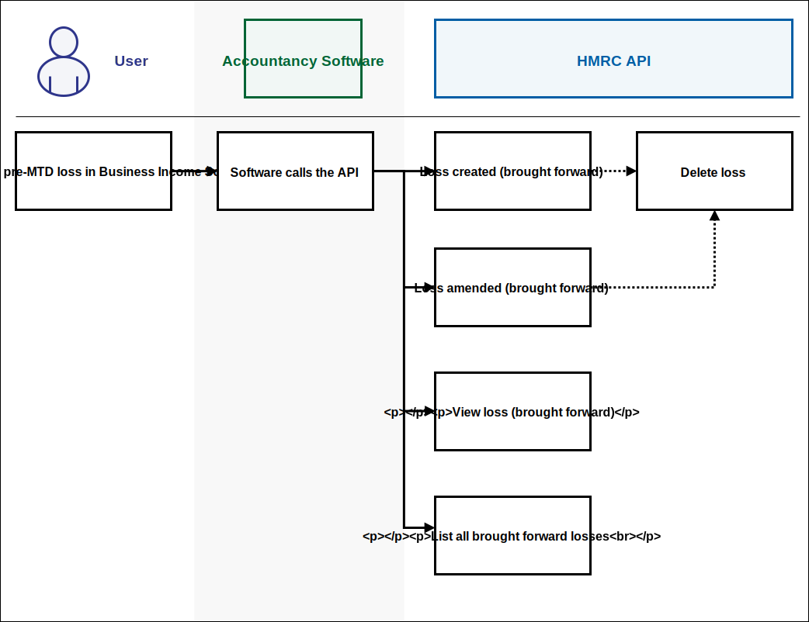

<!--- Section owner: MTD Programme --->
# Obligations and returns

## Agent and Business journey overview

AWAITING MISSING CONTENT

## Receive obligations

Once a business or agent has completed authentication and granted access to the software, the software can then use our APIs to request the information the customer has been provided at sign up and to find out the customer’s update obligation dates. 
The software must make their customers aware of their obligations.  

Actions to take are as follows:

* the list all self-employment businesses endpoint provides a list of all the customer’s self-employment businesses, along with the Business ID which the software will need to send to HMRC (this is currently limited to one but functionality to add more will be available later and stated in the roadmap)
* the Get a self-employment business or Get a UK property Business endpoint will provide the information HMRC holds for a specific self-employment or property business
Customers can also find out their obligations for their income source, through the following endpoints:
* retrieve self-employment business obligations - provides obligation dates for all self-employment businesses, including grace periods and whether obligations have been met or not 
* retrieve all UK property business obligations - provides obligation dates for their UK property, including grace periods and whether obligations have been met or not 

## Submit Periodic updates for SE and property businesses

Businesses, and agents who represent them, will be required to provide summary level information of their business income and expenses (transactional information to be kept digitally) on a quarterly basis or more often if they choose.

The deadline for meeting a quarterly obligation is one month after the obligation period end date. Software should communicate these deadlines clearly to the customer. Customers will also be able to view these deadlines within their Business Tax Account. 

The software package will need to convert the transactional information into summary totals for each category, for example expenses by category.

HMRC has provided the APIs to enable software to be able to send the summary information to HMRC for each income source and allow HMRC to provide a calculation based on all the information we have received to date.

When the update is received, HMRC checks if the submission is coming from an agent and if that agent is subscribed to agent services. If they are not subscribed to agent services an error is returned.

If the agent is subscribed, HMRC checks if the agent is authorised to act on behalf of that customer.

The service will include a number of business validation rules to ensure that all submissions are cross-validated before being accepted. HMRC cannot apply these rules without knowing that no further submission (APIs calls) will be sent by the customer for the period being validated.

Once all the information has been submitted to HMRC for that period, the software must use the trigger calculation API endpoint to inform HMRC that the user has finished submitting their information. As a response HMRC will provide a Calculation ID.

Note: this does not mean the customer has to declare that the submissions are ‘complete and correct’ (there is no ‘accuracy’ statement required at this point), only that the customer must indicate that they do not intend to provide any additional information at this point. There is nothing to stop them providing additional information anytime by resubmitting the update period with any changes that have been made to the previous submission.

Software will need to use that Calculation ID to use the retrieve calculation API endpoint.
Software should use that Calculation ID to call the individual calculation API endpoint a tax calculation API endpoint to get the result of the calculation.

The Calculation ID response includes:

* a ‘Year to Date’ estimated liability (which will total all period calculations to give an up to date view of the estimated
liability)
* a breakdown of how the estimated liability has been reached - at a minimum it will be the equivalent to an SA302
* a forecast figure of what the customer’s liability is likely to be at the end of the year based on the information provided to date. Customers will not be able to change this forecast figure as it is for information only.
Software can then call the relevant Get obligations APIs to establish whether or not the customer’s obligation has been met.
Note: In some cases, the obligation can take up to an hour to be confirmed as met.
This met obligation must be presented clearly to the customer in software. They will also check this information in their Business Tax Account. The customer will not receive any communication from HMRC to confirm that the obligation has been met. 
When a customer wants to send an update for a self-employment or property business, the software will need to provide summary totals for any income or expenses by category (mandatory quarterly) and allowances and adjustments (mandatory annual).

Software will need to use the following endpoints for each relevant source of income.
For three monthly updates:

* create a self-employment update period - this creates the update period and enables software to provide the summary totals of income and expenses for that specific self-employment business (this could be as little as a day or the whole 3 month obligation period)
* create a Furnished Holiday Lettings (FHL) property period - this creates the update period and enables software to provide the summary totals of income and expenses for FHL property income
* create a non FHL property update period - this creates the update period and enables software to provide the summary totals of income and expenses for non FHL property income
A customer can provide the information as frequently as they need, however there are a couple of validation rules that apply. 

Each update period cannot overlap the previous one, for example:

Update 1 – 6 April to 1 May is accepted 
Update 2 - 2 May to 31 May is accepted 
Update 3 – 28 May to 6 June is rejected because it overlaps the previous updates

Annual updates are mandatory annually but we have provided the functionality for customers to provide information more frequently if they choose. 

* update a self-employment annual summary - this enables the customer to provide any information about allowances and adjustments they might want to provide during the year to get a more accurate calculation 
* update a non FHL property business annual summary - this enables the customer to provide any information about allowances and adjustments they might want to provide during the year to get a more accurate calculation 
* update an FHL property business annual summary - this enables the customer to provide any information about allowances and adjustments they might want to provide during the year to get a more accurate calculation 
Checking if an obligation has been met 
Once the customer has finished sending all the information for that period and you have retrieved the calculation, you can then check whether the customer's obligations have been met. Note: in some cases, it can take up to an hour for the results to be confirmed.

## Submit Annual updates for SE and Property businesses

Annual updates are mandatory annually but we have provided the functionality for customers to provide information more frequently if they choose. 

* update a self-employment annual summary - this enables the customer to provide any information about allowances and adjustments they might want to provide during the year to get a more accurate calculation 
* update a non FHL property business annual summary - this enables the customer to provide any information about allowances and adjustments they might want to provide during the year to get a more accurate calculation 
* update an FHL property business annual summary - this enables the customer to provide any information about allowances and adjustments they might want to provide during the year to get a more accurate calculation 

## Retrieve a tax calculation

The individual calculations API allows a customer to:

•	list self-assessment tax calculations for a given National Insurance number (NINO) and tax year
•	trigger a self-assessment tax calculation for a given tax year. The result of the calculation can be explored via the “Retrieve a self-assessment tax calculation metadata” endpoint
•	retrieve high-level calculation metadata for a given Calculation ID
•	retrieve the calculated Income Tax and National Insurance contributions for a given NINO and Calculation ID
•	retrieve the taxable income that has been used in the self-assessment tax calculation for a given NINO and Calculation ID
•	retrieve the allowances, deductions and reliefs that exist for the self-assessment tax calculation for a given NINO and Calculation ID
•	retrieve the end-of-year Income Tax and National Insurance contribution estimates for a given NINO and Calculation ID
•	retrieve “info”, “warning” and “error” level messages linked to a Calculation ID

A calculation result (excluding metadata), once created, is an immutable calculation that provides a calculation result at a particular point in time. Any further income updates will require a new calculation to be triggered.

It is possible to return both in-year and crystallisation calculations using these endpoints. 

An in-year calculation is performed if the calculation was triggered by the "Trigger a self-assessment tax calculation" endpoint. A crystallisation calculation is performed if the calculation was triggered by the "Intent to crystallise" endpoint under the Self Assessment (MTD) API. 

For a crystallisation calculation the minimum number of endpoints that need to be called are: 

•	retrieve self assessment tax calculation metadata
•	retrieve self assessment tax calculation taxable income
•	retrieve self assessment tax calculation income tax NICs calculated
•	retrieve self assessment tax calculation allowances, deductions and reliefs (if applicable)
•	retrieve self assessment tax calculation messages (if applicable)

A Calculation ID will not always have a calculation result. It is possible that errors in previously submitted income data could prevent a calculation from being performed.

If calculation errors are present, these errors can be returned to the customer by the Retrieve self assessment tax calculation messages endpoint. 

Note: The self-assessment tax calculation endpoints under the Individual Calculations API will eventually replace the tax calculation endpoints under the existing Self Assessment API.

## Finalise business income (EOPS)

AWAITING MISSING CONTENT

### Business or Agent able to submit End of Period Statement through software

This is the process that allows the customer to finalise the profit or loss for any one source of business income. 
An EPOS (End of Period Statement) must be completed for each source of business income the taxpayer has (just as, the current Income Tax process for the SA103 and 105 schedules) so, for example, if a customer has one self-employment business and one property business they will have to complete two EOPS.

EOPS relates to the accounting period or basis period for each source of business income and cannot be completed before the end of that period. The customer does not need to complete it until 31 January Year 2. 

The process will take into account all the periodic and annual data already provided by the customer throughout the year. 
Note: Data received must cover the whole accounting period.

The customer must make sure they are happy with the information they have provided and add any additional information they have. This is likely to include tax and accounting adjustments, allowances or reliefs.

Software should present to the customer the information listed below. This can either be totalled up by software, but we have provided APIs for you to get it from HMRC systems as well Business Income Source Summary (BISS) for self-employment or property:

* Total Business Income
* Total Expenses
* Business Net Profit
* Business Net Loss
* Total Additions to net profit or deductions to net loss
* Total Deductions to net profit or additions to net loss
* Accounting Adjustments
* Taxable Profit
* Taxable Loss

This information must be shown to the customer for them to confirm it is complete and correct for that source of business income before they send the declaration. 

You could use the Business Income Source Summary APIs or opt to create this information within your package. HMRC will need the declaration to confirm the customer has seen it.

Note: The Declaration is the only mandatory API for this process, the exact text HMRC requires you to present is below 

 > **Declaration for Self Employment EOPS**

 > “I confirm that I have reviewed the information provided to establish the taxable profits for the relevant period ending in [insert tax year] together with the designatory data provided for that period and that it is correct and complete to the best of my knowledge. 

 >I understand that I may have to pay financial penalties or face prosecution if I give false information.”

 > **Declaration for Property EOPS**

 > “I confirm that I have reviewed the information provided to establish taxable profits for the relevant period ending in [insert tax year] together with the designatory data, including details of the properties for that period and that it is correct and complete to the best of my knowledge. 

 > I understand that I may have to pay financial penalties or face prosecution if I give false information.”

Making changes to previously submitted data during and after an End of Period Statement declaration
* if the information the customer has previously provided relating to that source of business income is not correct or complete (for example the previous information provided fails further validation or a periodic update is missing) then the EOPS declaration will be rejected and error messages returned.  The changes must be made to any relevant periodic or annual summaries, then follow the existing process of submitting updates and triggering the calculation before attempting the declaration again.
* if there are no error failures it is recommend that customers review any warning messages they have at this point or earlier as warnings will cause a failure at crystallisation.
* if after the customer has completed their EOPS declaration, they need to revise any of the data relating to that source of business income then they must make the change to the relevant periodic or annual summaries, then follow the existing process of submitting updates and triggering the calculation.

Note: making changes to data for previously submitted periods is covered in Customer or Agent changes and resubmits previously submitted data

## Provide information about how to treat a loss

### Losses and Claims

A self-employed business can make a loss when the trade expenses are more than the trade income.
If the business made a loss for a year prior to signing up to Making Tax Digital, the customer or agent will need to submit details of the loss to be brought forward.

<a href="figures/losses-api-diagram.svg" target="blank">Open the Losses process in a new tab</a>.

Vendors can use the [Brought forward losses](https://developer.service.hmrc.gov.uk/api-documentation/docs/api/service/individual-losses-api/1.0) endpoint to enable customers to submit the Brought forward loss to HMRC.

When the loss detail has been submitted, or if a loss arises for a tax year following sign up to Making Tax Digital, a claim will need to be made to either:

* utilise the loss against an income source for a specific year, or 
* claim to carry the loss forward so that it is available to use in later years

The Loss claims end point allows the user to:

* provide a list of Loss claims
* create a Loss Claim against an income source for a specific tax year
* show the detail of an existing Loss claim
* delete a previously entered Loss claim
* update a previously entered Loss claim

## Submit information about personal income

AWAITING MISSING CONTENT

## Crystallise liability (SA return)

This is the process that allows the customer to finalise their tax position for any one tax year, taking into account all sources of chargeable income and gains, whether business income or otherwise. 
In other words, this process will bring together all the data that a taxpayer needs to provide to HMRC to reach their final tax liability for a specific year. 

It is also the process by which most formal claims for reliefs and allowances and any elections will be made, where these were previously included within a Self Assessment tax return. 

Customers will also be able to tell us at this point (subject to the existing limits) how they wish any losses available to them to be treated.

Customers can crystallise from 6 April Year 1. The deadline for Crystallisation is 31 January Year 2. Software should remind customers to help them to meet this deadline. 

### Before Crystallisation

The customer must have completed any EOPS for each source of business income required for that tax year and provide information relating to any other income, expenses, allowances or adjustments they may have. 

Software should prompt customers to make sure they have considered the following potential additional income sources (this functionality will be provided through APIs over the next year)

* any pension contributions
* any pension income
* capital gains
* income from employment
* any income from partnerships
* any income from trusts

The following are available:

* any income from bank or building society interest
* any income from dividends
* any Gift Aid contributions they have made

Note: Any information currently provided via the existing Self Assessment process
If a customer needs to report information to HMRC that is not yet supported under MTD, they will need to complete a Self Assessment tax return.

To carry back a loss, the customer should contact HMRC, who will be able to apply this manually.

## When the customer is ready to crystallise

The software will have to let HMRC know that the customer is ready to crystallise. You can do this by calling the Intent to crystallise API endpoint. This will start the crystallisation process in HMRC. It will trigger the business validation rules and generate a final liability calculation.

The intent to crystallise response includes a Calculation ID similar to the trigger calculation endpoint. Software will then have to retrieve the calculation using the ‘Retrieve a Tax Calculation’ endpoint to get the calculation output.

This is the process that allows the customer to finalise their tax position for any one tax year, taking into account all sources of chargeable income and gains, whether business income or otherwise. 
In other words, this process will bring together all the data that a taxpayer needs to provide to HMRC to reach their final tax liability for a specific year. 

It is also the process by which most formal claims for reliefs and allowances and any elections will be made, where these were previously included within a Self Assessment tax return. 
Customers will also be able to tell us at this point (subject to the existing limits) how they wish any losses available to them to be treated.

Customers can crystallise from 6 April Year 1. The deadline for Crystallisation is 31 January Year 2. Software should remind customers to help them to meet this deadline. 

### Before Crystallisation

The customer must have completed any EOPS for each source of business income required for that tax year and provide information relating to any other income, expenses, allowances or adjustments they may have. 
Software should prompt customers to make sure they have considered the following potential additional income sources (this functionality will be provided through APIs over the next year)

* any pension contributions
* any pension income
* capital gains
* income from employment
* any income from partnerships
* any income from trusts

The following are available:

* any income from bank or building society interest
* any income from dividends
* any Gift Aid contributions they have made

Note: Any information currently provided via the existing Self Assessment process
If a customer needs to report information to HMRC that is not yet supported under MTD, they will need to complete a Self Assessment tax return.

To carry back a loss, the customer should contact HMRC, who will be able to apply this manually.

## When the customer is ready to crystallise

The software will have to let HMRC know that the customer is ready to crystallise. You can do this by calling the Intent to crystallise API endpoint. This will start the crystallisation process in HMRC. It will trigger the business validation rules and generate a final liability calculation.

The intent to crystallise response includes a Calculation ID similar to the trigger calculation endpoint. Software will then have to retrieve the calculation using the ‘Retrieve a Tax Calculation’ endpoint to get the calculation output.

The Calculation output provides a summary of each income source (e.g. self-employment, UK Property, UK bank and building society interest, etc.), plus a breakdown of allowances and reliefs applied, and a breakdown of the income tax and NIC payable.) broadly the equivalent of the current SA302.

Once software has called the intent to crystallise API, this will trigger a final liability calculation and software will receive a Calculation ID. 

The software must retrieve the intent to crystallise Calculation ID and display the calculation to the customer.  The customer must review this information and confirm it is complete and correct by sending the declaration.

If the customer thinks the calculation is incorrect as a result of incorrect data, they can go back and change any incorrect information they have provided. Once they have done this the software will have to call the ‘intent to crystallise’ API again to generate a new final liability.

If the customer does not agree with the calculation based on rules HMRC have used, then they will still need to declare against this calculation and follow the existing process to challenge the calculation.
If a software vendor identifies what they feel could be a technical issue with the Tax calculation API, they will need to contact the SDS Team immediately.

Once a customer is happy with all the information, they will have to agree to a declaration and send it to HMRC.

 > **The Declaration**

> “Before you can submit the information displayed here in response to your notice to file from HM Revenue & Customs, you must read and agree the following statement by 
[developer to decide how you manage the actual declaration for example a tick box or click confirm button or other]
The information I have provided is correct and complete to the best of my knowledge and belief
If you give false information you may have to pay financial penalties and face prosecution.”

Software must send the Calculation ID that matches the calculation the customer is declaring against with the declaration.
If a customer wants to make any changes following crystallisation they have 12 months from the statutory filing date to do this (the statutory filing date is 31 January following the end of the tax year, or 3 months from receipt of a Notice to File by the taxpayer whichever is the later). 

As with the current process the customer will make changes to the relevant information in software and resubmit the relevant periodic or annual updates, and follow the same process of triggering the calculation, they will not have to re-declare.

Note: any changes made following crystallisation will be a formal amendment under section 9ZA TMA 1970 

## View previously submitted updates

A customer may want to retrieve previously submitted data, for example before making a change the customer may want to request the last update provided before sending in any changes.  If the customer has recently started using your software, you may need to retrieve previous data.

### Periodic updates

Software can use the ‘self employment or property periodic updates’ endpoint to retrieve the list of updates made for that income source, or to find one or more period IDs.
The period ID is then used with the ‘get a self employment/property (FHL or Non FHL) periodic update’ endpoint to retrieve data for that update.

### Annual updates

Annual information can be provided throughout the year but there is only one period a year for the annual summary.
Software can use the ‘get a self employment/property (FHL and Non FHL) annual summary) endpoint providing the tax year for the annual period you are looking for.

## View liabilities and payments

 I don’t know if you want to include - if we are certian we will deliver it keep the place holder
 
## Make changes to previously submitted data

If a customer wants to make a change to the data that was included in a previously submitted update, software should use the following endpoints:

* for quarterly updates - Amend a self-employment periodic update or Amend a (FHL or Non FHL) property periodic update
* for Annual updates - use the same endpoints: Amend a self-employment annual summary or Amend an (FHL or Non FHL) property business annual summary

For all quarterly updates including self-employment, FHL property business and non-FHL property business:

* software will have to resubmit the new summary totals for the specific update period, the dates of the update period have to match exactly
* when a business resubmits an update period, the software will have to use the trigger calculation API and follow the same process as the submitting an update period process
Note: any changes that are made before the customer has crystallised is not a formal amendment
For all changes to annual summary updates including Self-employment, FHL property business and non-FHL property business:
* software will have to resubmit any changes to the summary totals for income source. The nature of this obligation means there is no need to create separate update periods
* where a business resubmits an annual summary update, previous figures that have been submitted must be sent again as well as any additional information. A zero or null will overwrite previously provided information
* the software will have to use the trigger calculation API and follow the same process

There are some key points for changing previously submitted updates:

* changes to Periodic updates - the update period you are trying to change must match the original update period exactly or it will be rejected
* changes to Annual updates - all figures previously supplied must be provided again, a Zero or a Null will overwrite any previously submitted information.

## Make an amendment after crystallisation

We’ll have to add this later when functionality is there

## Pay or get a repayment

Vendors should present messages to business users at key points in their journey that give them the option to make payments ahead of any obligation date to help spread the cost. We will deliver functionality that allows vendors to make users aware of payment dates.

There are multiple ways to make a payment for the Self Assessment regime, they can be found on GOV.UK at:

https://www.gov.uk/pay-self-assessment-tax-bill 

Vendors should, in their messaging, ask customers to visit that link so the customer can make a payment in the method that suits them.

The contents of this GOV.UK page will be updated and subject to change.

For a business to view what previous payments it has made to HMRC, vendors should present messages at key points in their journey that encourage them to visit their Business Tax Account at:

https://www.access.service.gov.uk/login/signin/creds

Vendors in their messaging should ask customers to visit that link. 

Customers can pay their tax bill by direct debit, making it easy and convenient to pay.
HMRC is delivering functionality for customers to set up direct debit instructions to pay tax when it becomes due. Customers may also set up a regular payment plan to ensure funds are available when tax becomes due.
These services will be available when a customer first subscribes to HMRCs tax services, and at any time after a customer has been subscribed through their digital tax
account. Access to the services will be via the customer’s digital tax account at:

https://www.access.service.gov.uk/login/signin/creds

Vendors in their messaging should ask customers to visit that link.  

Customers will be able to view payments made to HMRC in software. 
Details will be updated here once they are available.

## Make a change of circumstances

Functionality within the Business Tax Account will allow businesses to update their ‘change of circumstances’, until then they should call the HMRC helpline about a change of circumstances.
When the online functionality is delivered, vendors should present messages to business users regularly to remind them to check and update their details with HMRC.
Business users will then be able to do that by visiting their Business Tax Account at:

https://www.access.service.gov.uk/login/signin/creds 

Businesses will be able to update a range of information, including addresses, telephone numbers, e-mail and business type.

### Agent able to notify their own change of circumstances

This will initially be the usual process, which can be used to remove the agent reference number and Government Gateway (GGW) enrolment (HMRC-AS-AGENTS).
The scenario is needed where an agency firm ceases trading.
If an agent no longer wants to participate in MTD they can stop using their GGW ID.
An online interface is being developed as part of the wider change of circumstances solution.

## View Future obligations or previous returns in BTA

Some customers may wish to view information regarding their income tax for assurance purposes, this may also include any previous updates that have been submitted.

Vendors should make available within software products as many suitable features as possible to meet user needs.

Vendors can direct users to visit their [Business Tax Account](https://www.access.service.gov.uk/login/signin/creds) to view certain information.

A customer who has signed up for MTD and agreed to report using software, can choose to sign into their Business Tax Account and view information such as obligation periods, year-to-date and income tax calculations.
User research will continue, and further iterations will be made which will enhance the functionality of the Business Tax Account and help to improve user experience.

Future features will also enable customers to have a statement view, make a change of to their business information, along with links to make a card payments.

The Business Tax Account displays the following information:

* reporting obligations, and their status, per income source
* tax estimates
* year-to-date income tax calculation
